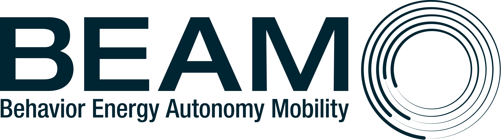

# BEAM

BEAM stands for Behavior, Energy, Autonomy, and Mobility. The model is being developed as a framework for a series of
research studies and demonstration projects in sustainable transportation at Lawrence Berkeley National Laboratory with
collaborators from other Department of Energy national labs, the private sector, and the public sector.

BEAM is built around the [Multi-Agent Transportation Simulation Framework](https://github.com/matsim-org/matsim) (
MATSim)--an open-source framework for implementing large-scale agent-based transport simulations--with extensive
modifications to allow for multithreaded within-day simulation of interacting agents. Many of BEAM's inputs, including
the road network, transit system, synthetic population, and input agent plans, can be exported from existing MATSim
models and read directly into BEAM, or they can be provided in simpler and more flexible formats. BEAM’s within-day
AgentSim simulation includes features such as on-demand mobility, mode choice, parking selection, and discretionary trip
planning. BEAM also adapts MATSim’s traffic network simulation and between-iteration replanning capabilities to allow it
to approximate dynamic user equilibrium across all of the choice dimensions offered its agents.

BEAM has always been designed as open-source software intended to benefit from an evolving ecosystem of related models
and products in the transportation and energy domain. These include activity-based travel demand models, which allow for
a more sophisticated treatment of agents’ pre-day travel planning, vehicle energy consumption models, metrics for
summarizing a transport system’s accessibility and efficiency, and integration with power grid models. While BEAM is
designed to flexibly and efficiently link with other models of transportation system components, it also allows for an
implementation to be built from scratch while relying only on free and publicly available data processed through several
widely-used and opensource tools.

## Documentation

The BEAM team maintains both a [Github wiki](https://github.com/LBNL-UCB-STI/beam/wiki)
and [online documentation](http://beam-lbnl.readthedocs.io/en/latest/about.html)

### Getting started:

- Try running BEAM with our
  simple [getting started guide](http://beam-lbnl.readthedocs.io/en/latest/users.html#getting-started)
- Check out the [developer guide](http://beam-lbnl.readthedocs.io/en/latest/developers.html) for more detailed
  information on using or contributing to the BEAM project

### Questions:

- Please visit the [Wiki page](https://github.com/LBNL-UCB-STI/beam/wiki/Help---FAQs)
- Users are welcome to submit [Issues](https://github.com/LBNL-UCB-STI/beam/issues)
  and [Pull requests](https://github.com/LBNL-UCB-STI/beam/pulls)
- The group [beam-model-users@googlegroups.com](mailto:beam-model-users@googlegroups.com) is a helpful platform for contacting
  BEAM users and developers with questions and requests

## Project website:

[https://transportation.lbl.gov/beam/](https://transportation.lbl.gov/beam/)

## Report:

A detailed description of BEAM's component algorithms and software, along with descriptions of a New York City case
study, have been published as
a [LBNL Lab report](https://eta-publications.lbl.gov/sites/default/files/beam_report_2024feb07.pdf)
