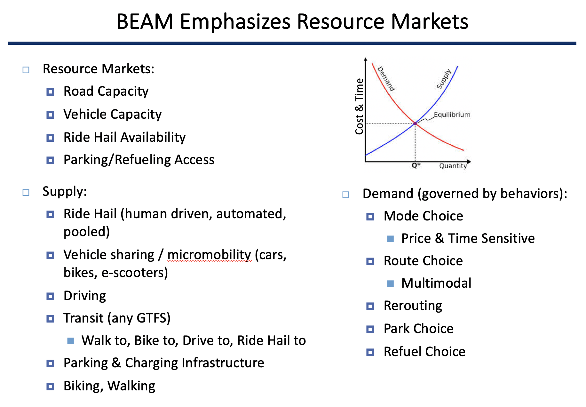

About BEAM
==========

Overview
--------

BEAM stands for Behavior, Energy, Autonomy, and Mobility. The model is being developed as a framework for a series of research studies in sustainable transportation at Lawrence Berkeley National Laboratory and the UC Berkeley Institute for Transportation Studies.  

BEAM is an extension to the MATSim (Multi-Agent Transportation Simulation) model, where agents employ reinforcement learning across successive simulated days to maximize their personal utility through plan mutation (exploration) and selecting between previously executed plans (exploitation). The BEAM model shifts some of the behavioral emphasis in MATSim from across-day planning to within-day planning, where agents dynamically respond to the state of the system during the mobility simulation. In BEAM, agents can plan across all major modes of travel including driving, walking, biking, transit, and transportation network companies (TNCs).

These key features are summarized here and described in further detail below:

* **MATSim Integration** BEAM leverages the MATSim modeling framework[1], an open source simulation tool with a vibrant community of global developers. MATSim is extensible (BEAM is one of those extensions) which allows modelers to utilize a large suite of tools and plug-ins to serve their research and analytical interests.

* **Resource Markets** While BEAM can be used as a tool for modeling and analyzing the detailed operations of a transportation system, it is designed primarily as an approach to modeling resource markets in the transportation sector. The transportation system is composed of several sets of mobility resources that are in limited supply (e.g. road capacities, vehicle seating, ride hail fleet availability, refueling infrastructure). By adopting the MATSim utility maximization approach to achieving user equilibrium for traffic modeling, BEAM is able to find the corresponding equilibrium point across all resource markets of interest.

* **Dynamic Within-Day Planning** Because BEAM places a heavy emphasis on within-day planning, it is possible to simulate modern mobility services in a manner that reflects the emerging transportation system. For example, a virtual TNC in BEAM responds to customer inquiries by reporting the wait time for a ride, which the BEAM agents consider in their decision on what service or mode to use. 

* **Rich Modal Choice** BEAM’s mode choice model is structured so that agents select modal strategies (e.g. “car” versus “walk to transit” versus “ride hail”) for each tour prior to the simulation day, but resolve the outcome of these strategies within the day (e.g. route selection, standard ride hail versus pooled, etc.).  

* **Transportation Network Companies** TNCs are already changing the mobility landscape and as driverless vehicles come online, the economics of these services will improve substantially. In BEAM, TNCs are modeled as a fleet of ride hail vehicles controlled by a centralized manager that responds to requests from customers and dispatches vehicles accordingly. The fleet can be composed of human drivers, autonomous vehicles, or a hybrid of both human and driverless. The management of the fleet has been developed as an API that can be implemented using mutliple algorithms, allowing users of BEAM to test their own fleet control strategies. Finally, we have implemented a scalable pooling algorithm that efficiency matches customers and pools them into vehicles. Pooled ride hail is treated as a distinct mode and therefore only customers who request such a ride are considered for pooling.

* **Parallel Within Day Dynamics** BEAM is written primarily in Scala and leverages the Akka_ library for currency which implements the [Actor Model of Computation](https://en.wikipedia.org/wiki/Actor_model). These tools enable the model to run as a parallel discrete event simulation. This capability is critical to simulate a transportation system that is more dynamic (primarily via on-demand forms of mobility) in a manner than can still achieve non-trivial scales. In addition, this approach allows BEAM to continue to use parallel processing while also simulating resource competition, e.g. agents are accessing finite resources like parking spaces, charging infrastructure, or micromobility vehicles in a manner that is still parallelized but nevertheless disallows one resource to be used by two agents simultaneously. 
  
* **Open Source Code and Data** BEAM is released under a permissive open source license. The code can be copied, modified, and/or used for any purpose. In addition, we publish all of the data necessary to do production runs of BEAM. In other words, anyone can run the same BEAM scenarios that we use for our own projects and research activities. At the moment this consists of a San Francisco Bay Area application that has been calibrated and validated for use by the U.S. DOE's SMART Mobility Consortium. 

* **Cloud Deployable** BEAM has been designed to integrate with Amazon Web Services including a framework to automatically deploy simulation runs to the cloud, to monitor those runs in real-time, and then upload results to S3 for permanent storage. An amazon EC2 snapshot capable of running BEAM can be made available to interested users upon request.

.. _Akka: https://akka.io/

MATSim Integration
------------------

MATSim_ is a well established agent-based transportation simulation framework with hundreds of users and developers worldwide. BEAM leverages much of the overall structure and conventions of MATSim, but replaces several facilities with new software. The most important of these are the Mobility Simulation and Router. 

.. _MATSim: http://www.matsim.org/

BeamMobSim
^^^^^^^^^^
When BEAM is executed, the MATSim engine manages loading of most data (population, households, vehicles, and the network used by PhysSim) as well as executing the MobSim -> Scoring -> Replanning iterative loop. BEAM takes over the MobSim, replacing the legacy MobSim engines (i.e. QSim) with the BeamMobSim.

.. image:: _static/figs/matsim-loop.png

The BeamMobSim is composed of two simulators, the **AgentSim** and the **PhysSim**. These simulators are related to each other and to the router as illustrated in the following diagram:

.. image:: _static/figs/beam-structure-med.png

AgentSim
^^^^^^^^

The AgentSim is designed to execute the daily plans of the population, allowing the agents to dynamically resolve how limited transportation resources are allocated (see :ref:`resource-markets`). 

All movements in the AgentSim occur via "teleportation" as discrete events. In other words, given a route and a travel time, an agent simply schedules herself to "arrive" at the destination accordingly. When this occurs, a PathTraversal Event is thrown -- one for each vehicle movement, not necessarily each passenger movement -- which is used by the PhysSim to simulate traffic flow, resolve congestion, and update travel times in the router so that in future iterations, agents will teleport according to travel times that are consistent with network congestion.

PhysSim
^^^^^^^

The PhysSim simulates traffic on the road network. The underlying simulation engine is based on the Java Discrete Event Queue Simulator (JDEQSim_) from the MATSim framework. The JDEQSim then simulates traffic flow through the system and updated the Router with new network travel times for use in subsequent iterations.

.. _JDEQSim: https://www.researchgate.net/publication/239925133_Performance_Improvements_for_Large_Scale_Traffic_Simula-_tion_in_MATSim

JDEQSim was designed as a MobSim engine for MATSim, so it is capable of simulating activities and movements through the network. In BEAM, we use JDEQSim within PhysSim as purely a **vehicle** movement simulator.  As PathTraversalEvents are received by the PhysSim, a set of MATSim Plans are created, with one plan for each vehicle in the AgentSim. These plans include "Activities" but they are just dummy activities that bracket the movement of each vehicle.

Currently, PhysSim and AgentSim run serially, one after another. This is due to the fact that the PhysSim is substantially faster to run than the AgentSim, because the PhysSim does not need to do any routing calculations. As improvements to AgentSim reduce run times, future versions of BEAM will likely allow AgentSim and PhysSim to run concurrently, or even be run in a tightly coupled manner where each teleportation in AgentSim is replaced with a direct simulation of the propagation of vehicles through the network by the PhysSim.

R5 Router
^^^^^^^^^

BEAM uses the `R5 routing engine`_ to accomplish multi-modal routing. Agents from BEAM make request of the router, and the results of the routing calculation are then transformed into objects that are directly usable by the BEAM agents to choose between alternative routes and move throughout the system. 

.. _R5 routing engine: https://github.com/conveyal/r5

.. _matsim-events:

GraphHopper Router
^^^^^^^^^

If configured BEAM can use GraphHopper router (https://github.com/graphhopper/graphhopper) in addition to R5. Note that
currently GraphHopper doesn't work with transit routes, for these it will delegate to R5.

To enable GraphHopper set in config file

`beam.routing.carRouter="staticGH"` or
`beam.routing.carRouter="quasiDynamicGH"`

The difference is that for `quasiDynamicGH` Router will create multiple GraphHopper instances for each travel time bin.

GraphHopper router can be configured to use alternative routes (https://github.com/graphhopper/graphhopper/pull/640)

To enable it set in config file

`beam.routing.gh.useAlternativeRoutes = true`

MATSim Events
^^^^^^^^^^^^^

BEAM adopts the MATSim convention of throwing events that correspond to key moments in the agent's day. But in BEAM, there are two separate event managers, one for the ActorSim and another for the PhysSim. 

The standard events output file (e.g. `0.events.csv`) comes from the AgentSim, but in the outputs directory, you will also find an events file from the PhysSim (e.g. `0.physSimEvents.xml.gz`).  The events from AgentSim pertain to agents while the events in PhysSim pertain to vehicles. This is an important distinction.

The following MATSim events are thrown within the AgentSim: 

* ActivityEndEvent
* PersonDepartureEvent
* PersonEntersVehicleEvent
* PersonLeavesVehicleEvent
* PersonArrivalEvent
* ActivityStartEvent

The following MATSim events are thrown within the PhysSim: 

* ActivityEndEvent - these are dummy activities that bracket every vehicle movement
* PersonDepartureEvent - should be interpreted as **vehicle** departure
* LinkEnterEvent
* Wait2LinkEvent / VehicleEntersTraffic 
* LinkLeaveEvent
* PersonArrivalEvent - should be interpreted as **vehicle** arrival
* ActivityStartEvent - these are dummy activities that bracket every vehicle movement

Extensions and modules written to observe the above MATSim events can be seamlessly integrated with BEAM in a read-only manner (i.e. for analysis, summary, visualization purposes). However, extensions that are designed to accomplish "within-day" replanning in MATSim will not be directly compatible with BEAM. This is because BEAM already does extensive "within-day" replanning in a manner that is substantially different from QSim.

In addition to the standard MATSim events described above, BEAM throws additional events that correspond to the act of choosing a Mode (`ModeChoiceEvent`) and of vehicle movements through the network (`PathTraversalEvent`). 

All events (both MATSim and BEAM-specific) and their field descriptions are described in further detail in :ref:`event-specifications`.

.. _resource-markets:

Resource Markets
----------------

While BEAM can be used as a tool for modeling and analyzing the detailed operations of a transportation system, it is designed primarily as an approach to modeling resource markets in the transportation sector. 

The transportation system is composed of several sets of mobility resources that are in limited supply (e.g. road capacities, vehicle seating, ride hail fleet availability, refueling infrastructure). With the exception of road capacities, all resources in BEAM are explicitly modeled. For example, there are a finite number of seats available on transit vehicles and there are a finite number of ride hail drivers. 

As resources are utilized by travelers, they become unavailable to other travelers. This resource competition is resolved dynamically within the AgentSim, making it impossible for multiple agents to simultaneously utilize the same resource.

The degree to which agents use resources is determined both by resource availability and traveler behavior. As the supply of ride hail drivers becomes limited, the wait times for hailing a ride increase, which leads to lower utility scores in the mode choice process and therefore reduced consumption of that resource.

By adopting the MATSim utility maximization approach to achieving user equilibrium for traffic modeling, BEAM is able to find the corresponding equilibrium point across all resource markets of interest. Each agent maximizes her utility through the replanning process (which occurs outside the simulation day) as well as within the day through dynamic choice processes (e.g. choosing mode based on with-in day evaluation of modal alternatives).

Ultimately, the combined outcome of running BEAM over successive iterations is a system equilibrium that balances the trade-offs between all resources in the system.

In the figure above, the resource markets that are functioning in BEAM v0.8.0 are listed. 

Dynamic Within-Day Planning
---------------------------
Because BEAM places a heavy emphasis on within-day planning, it is possible to simulate modern mobility services in a manner that reflects the emerging transportation system. 

For example, a virtual TNC in BEAM responds to customer inquiries by reporting the wait time for a ride, which the BEAM agents consider in their decision on what service or mode to use.

Rich Modal Choice
-----------------
BEAM’s mode choice model is structured so that agents select modal strategies (e.g. “car” versus “walk to transit” versus “ride hail”) for each tour prior to the simulation day, but resolve the outcome of these strategies within the day (e.g. route selection, standard ride hail versus pooled, etc.).  BEAM currently supports a simple multinomial logit choice model and a more advanced model is under development and will be fully supported by Spring 2018. 

Plug-in Electric Vehicle Modeling with BEAM
-------------------------------------------

In 2016, BEAM was originally developed to simulate personally-owned plug-in electric vehicles (PEVs), with an emphasis on detailed representation of charging infrastructure and driver behavior around charging. 

In 2017, BEAM underwent a major revision, designed to simulate all modes of travel and to prepare the software for scalability and extensibility. We therefore no longer support the "PEV Only" version of BEAM, though the codebase is still available on the BEAM Github repository under the branch pev-only_. In 2018, PEVs were re-implemented in BEAM following the new framework. In addition, BEAM supports modeling the refueling of fleets of electrified ride hail vehicles. 
 
.. _pev-only: https://github.com/LBNL-UCB-STI/beam/tree/pev-only

The key features of the "PEV Only" version of BEAM are summarized here and described in further detail in reports linked below. 

* **Detailed Representation of Charging Infrastructure** In BEAM, individual chargers are explicitly represented in the region of interest. Chargers are organized as sites that can have multiple charging points which can have multiple plugs of any plug type. The plug types are  defined by their technical characteristics (i.e. power capacity, price, etc.) and their compatibility with vehicles types (e.g. Tesla chargers vs. CHAdeMO vs. SAE). Physical access to chargers is also represented explicitly, i.e., charging points can only be accessed by a limited number of parking spaces. Chargers are modeled as queues, which can be served in an automated fashion (vehicle B begins charging as soon as vehicle A ends) or manually by sending notifications to agents that it is their turn to begin a charging session.

* **Robust Behavioral Modeling** The operational decisions made by PEV drivers are modeled using discrete choice models, which can be parameterized based on the outcomes of stated preference surveys or reveled preference analyses. For example, the decision of whether and where to charge is currently modeled in BEAM as a nested logit choice that considers a variety of factors including the location, capacity, and price of all chargers within a search radius in addition to the state of charge of the PEV and features of the agent’s future mobility needs for the day. The utility functions for the model are in part based on empirical work by Wen et al.[2] who surveyed PEV drivers and analyzed the factors that influence their charging decisions.

Contact Information
-------------------
Primary Technical Contacts: 

Colin Sheppard
colin.sheppard@lbl.gov

Rashid Waraich
rwaraich@lbl.gov

References
----------

1.	Horni, A., Nagel, K. and Axhausen, K.W. (eds.) 2016 `The Multi-Agent Transport Simulation MATSim`_. London: Ubiquity Press. DOI: http://dx.doi.org/10.5334/baw. License: CC-BY 4.0.
2.	Wen, Y., MacKenzie, D. & Keith, D. Modeling the Charging Choices of Battery Electric Vehicle Drivers Using Stated Preference Data. TRB Proc. Pap. No 16-5618

.. _The Multi-Agent Transport Simulation MATSim: http://www.matsim.org/the-book
