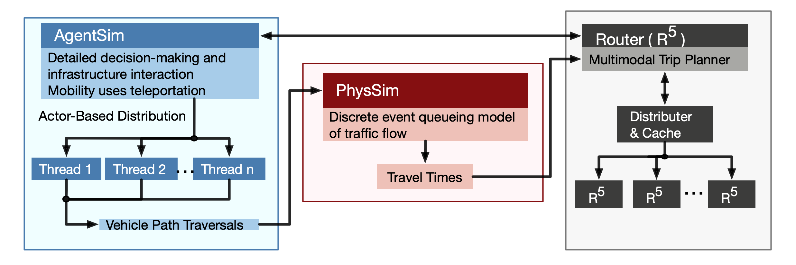

About BEAM
==========

Overview
--------

BEAM stands for Behavior, Energy, Autonomy, and Mobility. The model is being developed as a framework for a series of research studies in sustainable transportation at Lawrence Berkeley National Laboratory and the UC Berkeley Institute for Transportation Studies.  

BEAM is an extension to the MATSim (Multi-Agent Transportation Simulation) model, where agents employ reinforcement learning across successive simulated days to maximize their personal utility through plan mutation (exploration) and selecting between previously executed plans (exploitation). The BEAM model shifts some of the behavioral emphasis in MATSim from across-day planning to within-day planning, where agents dynamically respond to the state of the system during the mobility simulation. In BEAM, agents can plan across all major modes of travel including driving, walking, biking, transit, and transportation network companies (TNCs).

These key features are summarized here and described in further detail below:

* **MATSim Integration** BEAM leverages the MATSim modeling framework[1], an open source simulation tool with a vibrant community of global developers. MATSim is extensible (BEAM is one of those extensions) which allows modelers to utilize a large suite of tools and plug-ins to serve their research and analytical interests.

* **Resource Markets** While BEAM can be used as a tool for modeling and analyzing the detailed operations of a transportation system, it is designed primarily as an approach to modeling resource markets in the transportation sector. The transportation system is composed of several sets of mobility resources that are in limited supply (e.g. road capacities, vehicle seating, TNC fleet availability, refueling infrastructure). By adopting the MATSim utility maximization approach to achieving user equilibrium for traffic modeling, BEAM is able to find the corresponding equilibrium point across all resource markets of interest.

* **Dynamic Within-Day Planning** Because BEAM places a heavy emphasis on within-day planning, it is possible to simulate modern mobility services in a manner that reflects the emerging transportation system. For example, a virtual TNC in BEAM responds to customer inquiries by reporting the wait time for a ride, which the BEAM agents consider in their decision on what service or mode to use. 

* **Rich Modal Choice** BEAM’s mode choice model is structured so that agents select modal strategies (e.g. “car” versus “walk to transit” versus “TNC”) for each tour prior to the simulation day, but resolve the outcome of these strategies within the day (e.g. route selection, standard TNC versus pooled, etc.).  BEAM currently supports a simple multinomial logit choice model and a more advanced model is under development and will be fully supported by Spring 2017. 
* **Transporation Network Companies** TNCs are already changing the mobility landscape and as driverless vehicles come online, the economics of these services will improve substantially. In BEAM, TNCs are modeled as a fleet of taxis controlled by a centralized manager that responds to requests from customers and dispatches vehicles accordingly. In 2018, BEAM will be extended to simulate the behavioral processes of TNC drivers as well as implement control algorithms designed to optimize fleets of fully automated vehicles.

* **Designed for Scale** BEAM is written primarily in Scala and leverages the [Akka](https://akka.io/) library for currenency which implements the [Actor Model of Computation](https://en.wikipedia.org/wiki/Actor_model). This approach simplifies the process of deploying transportation simulations at full scale and utilizing high performance computing resources. BEAM has been designed to integrate with Amazone Web Services including a framework to automatically deploy simulation runs to the cloud. 

MATSim Integration
------------------

[MATSim](http://www.matsim.org/) is a well established agent-based transportation simulation framework with hundreds of users and developers worldwide. BEAM leverages much of the overall structure and conventions of MATSim, but replaces several facilities with new software. The most important of these are the Mobility Simulation and Router. 

BeamMobSim
^^^^^^^^^^
When BEAM is executed, the MATSim engine manages loading of most data (population, households, vehicles, and the network used by PhysSim) as well as executing the MobSim -> Scoring -> Replanning iterative loop. BEAM takes over the MobSim, replacing the legacy MobSim engines (i.e. QSim) with the the BeamMobSim.

.. image:: _static/figs/matsim-loop.png

The BeamMobSim is composed of two simulators, the **AgentSim** and the **PhysSim**. These simulators are related to each other and to the router as illustrated in the following diagram:

AgentSim
^^^^^^^^

The AgentSim is designed to execute the daily plans of the population, allowing the agents to dynamically resolve how limited transportation resources are allocated (see :ref:`resource-markets`). 

All movements in the AgentSim occur via "teleportation" as discrete events. In other words, given a route and a travel time, an agent simply schedules herself to "arrive" at the destination accordingly. When this occurs, a PathTraversal Event is thrown -- one for each vehilce movement, not necessarily each passenger movement -- which is used by the PhysSim to simulate traffic flow, resolve congestion, and update travel times in the router so that in future iterations, agents will teleport according to travel times that are consistent with network congestion.

PhysSim
^^^^^^^

The PhysSim simulates traffic in the road network. The underlying simulation engine is based on the JDEQSim from the MATSim framework. As PathTraversalEvents are recieved by the PhysSim, a set of MATSim Plans are created, with one plan for each vehicle in the AgentSim.

R5 Router
^^^^^^^^^

BEAM uses the [R5 routing engine](https://github.com/conveyal/r5) to accomplish mult-modal routing. Agents from BEAM make request of the router, and the results of the routing calculation are then transformed into objects that are directly usable by the BEAM agents to choose between alternative routes and move throughout the system. 

MATSim Events
^^^^^^^^^^^^^

The BeamMobSim adopts the MATSim convention of throwing events that correspond to key moments in the agent's day. The following MATSim events are thrown interally:

* ActivityEndEvent
* PersonDepartureEvent
* PersonEntersVehicleEvent
* PersonLeavesVehicleEvent
* PersonArrivalEvent
* ActivityStartEvent

Extensions and modules written to observe the above MATSim events and do analysis can be seemlessly integrated with BEAM. However, extensions that are designed to accomplish "within-day" replanning in MATSim will not be compatible with BEAM. This is because BEAM already does extensive with-in day replanning in a manner that is substantially different from QSim.

In addition, BeamMobSim throws two additional events that correspond to the act of choosing a Mode (`ModeChoiceEvent`) and of vehicle movements through the network (`PathTraversalEvent`). 

Finally, BEAM decouples the AgentSim

.. _resource-markets:

Resource Markets
----------------

Plug-in Electric Vehicle Modeling with BEAM
-------------------------------------------

In 2016, BEAM was originally developed to simulate personally-owned plug-in electric vehicles (PEVs), with an emphasis on detailed representation of charging infrastructure and driver behavior around charging. 

In 2017, BEAM underwent a major revision, designed to simulate all modes of travel and to prepare the software for scalability and extensibility. We therefore no longer support the "PEV Only" version of BEAM, though the codebase is still availble on the BEAM Github repository under the branch [pev-only](https://github.com/LBNL-UCB-STI/beam/tree/pev-only). In 2018, PEVs will be re-implemented in BEAM following the new framework. In addition, BEAM will support modeling the refueling of fleets of electrified TNCs. 

The key features of the "PEV Only" version of BEAM are summarized here and described in further detail in reports linked below. 

* **Detailed Representation of Charging Infrastructure** In BEAM, individual chargers are explicitly represented in the region of interest. Chargers are organized as sites that can have multiple charging points which can have multiple plugs of any plug type. The plug types are  defined by their technical characteristics (i.e. power capacity, price, etc.) and their compatibility with vehicles types (e.g. Telsa chargers vs. CHAdeMO vs. SAE). Physical access to chargers is also represented explicitly, i.e., charging points can only be accessed by a limited number of parking spaces. Chargers are modeled as queues, which can be served in an automated fashion (vehicle B begins charging as soon as vehicle A ends) or manually by sending notifications to agents that it is their turn to begin a charging session.

* **Robust Behavioral Modeling** The operational decisions made by PEV drivers are modeled using discrete choice models, which can be parameterized based on the outcomes of stated preference surveys or reveled preference analyses. For example, the decision of whether and where to charge is currently modeled in BEAM as a nested logit choice that considers a variety of factors including the location, capacity, and price of all chargers within a search radius in addition to the state of charge of the PEV and features of the agent’s future mobility needs for the day. The utility functions for the model are in part based on empirical work by Wen et al.[2] who surveyed PEV drivers and analyzed the factors that influence their charging decisions.

Contact Information
-------------------
Primary Technical Contacts: 

Colin Sheppard
colin.sheppard@lbl.gov

Rashid Waraich
rwaraich@lbl.gov

Reports and Papers
------------------

“Modeling Plug-in Electric Vehicle Trips, Charging Demand and Infrastructure”.

References
----------

1.	Horni, A., Nagel, K. and Axhausen, K.W. (eds.) 2016 [The Multi-Agent Transport Simulation MATSim](http://www.matsim.org/the-book). London: Ubiquity Press. DOI: http://dx.doi.org/10.5334/baw. License: CC-BY 4.0.
2.	Wen, Y., MacKenzie, D. & Keith, D. Modeling the Charging Choices of Battery Electric Vehicle Drivers Using Stated Preference Data. TRB Proc. Pap. No 16-5618
