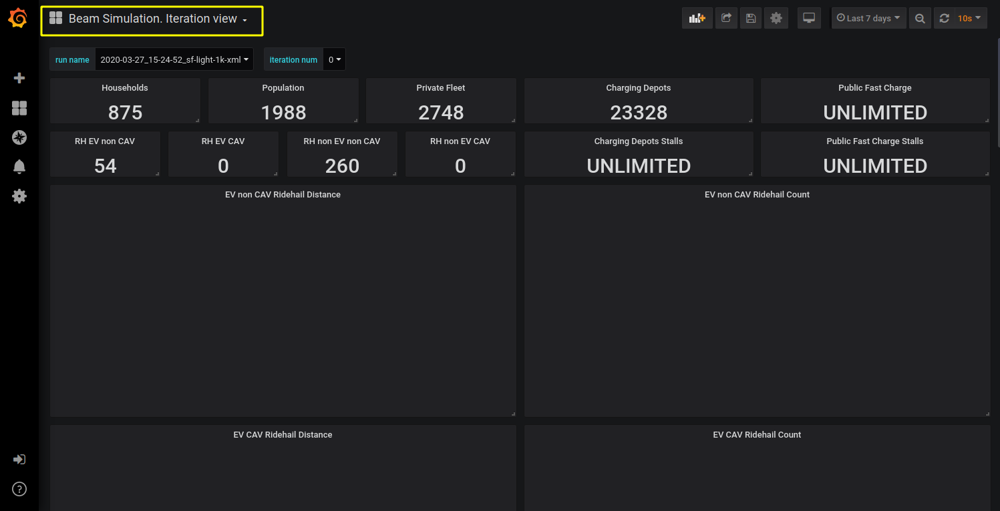

Real time graphs
====================

Grafana
-----------

`Grafana <https://grafana.com/>`_ is the open source analytics and monitoring solution and may be used to view various BEAM metrics in real time during BEAM execution.

Grafana is a tool to display data from data source. In our case the data source is `InfluxDB <https://www.influxdata.com/products/influxdb-overview/>`_ .

Docker installation and configuration
--------------------------------------

There is a docker image with configured Grafana and InfluxDB to work with BEAM thus one need to install docker in order to use Grafana.

Ubuntu Linux users
^^^^^^^^^^^^^^^^^^^

Requirements
"""""""""""""""""""

* 64-bit version of one of these Ubuntu versions: Disco 19.04, Cosmic 18.10, Bionic 18.04 (LTS), Xenial 16.04 (LTS)

Installation
"""""""""""""""""""

There is an official `installation guide for Ubuntu Linux users <https://docs.docker.com/install/linux/docker-ce/ubuntu/>`_ and
a `Post-installation guide for Linux <https://docs.docker.com/install/linux/linux-postinstall/>`_ with optional procedures
for configuring Linux hosts to work better with Docker for non-root users.

Otherwise use those commands::

    sudo apt-get update
    sudo apt-get install docker-ce docker-ce-cli containerd.io docker-compose

Mac users
^^^^^^^^^^^^

Requirements
"""""""""""""""""""

* Mac hardware must be a 2010 or newer model
* macOS must be version 10.13 or newer
* VirtualBox prior to version 4.3.30 must not be installed as it is not compatible with Docker Desktop.

Installation
"""""""""""""""""""

There is an official `installation guide for Mac users <https://docs.docker.com/docker-for-windows/install>`_.

Otherwise download and install `Docker CE for Mac (Stable) <https://download.docker.com/mac/stable/Docker.dmg>`_.

Windows users
^^^^^^^^^^^^^^^^^

Requirements
"""""""""""""""""""

* Windows 10 64-bit (Pro, Enterprise, or Education (Build 15063 or later)) - these are pre-req for Docker Desktop.
* Enable Hyper-V & Containers Windows features (usually done by docker installer).
* BIOS-level hardware virtualization support must be enabled in the BIOS settings (here’s a `guide <#virtualization>`_ on how to do it)

Installation
"""""""""""""""""""

There is an official `installation guide for Windows users <https://docs.docker.com/docker-for-windows/install>`_.

Otherwise download and install `Docker CE for Windows (Stable) <https://download.docker.com/win/stable/Docker%20for%20Windows%20Installer.exe>`_.

Virtualization
""""""""""""""""""

Windows users should also check if virtualization is enabled in firmware. To do so, check the Performance tab on the Task Manager:

    check if virtualization is enabled

If not, virtualization should be enabled in BIOS:

* Reboot your computer
*

    Right when the computer is coming up from the black screen, press Delete, Esc, F1, F2, or F4. Each computer manufacturer uses
    a different key but it may show a brief message at boot telling you which one to press. If you miss it the first time, reboot and try again.
    It helps to tap the key about twice a second when the computer is coming up.

* In the BIOS settings, find the configuration items related to the CPU. These can be in under the headings Processor, Chipset, or Northbridge.
* Enable virtualization; the setting may be called VT-x, AMD-V, SVM, or Vanderpool. Enable Intel VT-d or AMD IOMMU if options are available.
* Save your changes and reboot.

Another `instruction with examples for different computer manufacturers <https://2nwiki.2n.cz/pages/viewpage.action?pageId=75202968>`_.

Verify docker installation
^^^^^^^^^^^^^^^^^^^^^^^^^^^^^^^^

Verify that docker is installed correctly by typing in terminal or in a command window::

    docker run hello-world

Output should contain::

    Hello from Docker!
    This message shows that your installation appears to be working correctly.

Control Grafana using gradle commands
----------------------------------------------

Start Grafana
^^^^^^^^^^^^^^^^^

To run Grafana one should use gradle command grafanaStart without any parameters. The command will start Grafana and InfluxDB docker container,
configure them and print URLs to Grafana dashboards after the docker image is running. ::

    ./gradlew grafanaStart

After that command execution one may run BEAM multiple times, all data will be stored in the InfluxDB database. And all data may be viewed in Grafana dashboards.

Stop Grafana
^^^^^^^^^^^^^^^^^

While Grafana is stopping all collected by InfluxDB data will be stored in snapshot on a file system.
The snapshot will be used next time when Grafana start thus data won't be lost.

To stop Grafana one should use gradle command grafanaStop without any parameters. ::

    ./gradlew grafanaStop

Clear collected data
^^^^^^^^^^^^^^^^^^^^^^^^^^^^

To clear all collected by InfluxDB data from BEAM runs one should use gradle command grafanaClearData.
This command should be used after Grafana was stopped. ::

    ./gradlew grafanaClearData

Work with Grafana graphs
---------------------------

There are different `views` which are called `dashboards` that allow you to see BEAM results in different ways:

*

    The **Global View** plots output metrics from the simulation in an iteration-by-iteration format. I.e. this view is good
    for seeing how the system evolves over the iterations as user equilibrium is established.

*

    The **Iteration View** shows the output of a single iteration within BEAM and plots metrics on an hourly time scale,
    this is useful for seeing granular dynamics like the use of charging infrastructure over time.

*

    In both of the previous views, only one BEAM run may be viewed at one time but there are also the **Global View Comparison**
    and **Iteration View Comparison** which allow you to view two BEAM runs at the same time or one BEAM run but with different iterations.

* The **Iteration Map View** allows you to see various BEAM metrics displayed on a map with ability to choose any combination of available metrics, hour and iteration to display.

Select dashboard
^^^^^^^^^^^^^^^^^^^^^^^^^

To choose a dashboard to view one can click on a dashboard name:

    choose dashboard

Select BEAM run
^^^^^^^^^^^^^^^^^^^^^^^^^

To select which BEAM run graphs should be displayed one can use the switch ``run name``. A BEAM run name has the format: *date_time_simulation-name*
where *date* and *time* are local date and time for pc where BEAM is running and the simulation name is taken from ``beam.agentsim.simulationName``
config value. The BEAM run list containing the ``run name`` switch is updated after a page refresh. So make sure to refresh your browser after
a new BEAM run is started and output from the simulation have begun to accumulate. If there are no active BEAM runs in the local history then one will see no choice for ‘run_name’:

    BEAM run name switch

Disable and enable data traces
^^^^^^^^^^^^^^^^^^^^^^^^^^^^^^^^^^

It is possible to disable and enable some of value traces on a graph by clicking on the name of a trace.

    enable | disable traces

Select BEAM iteration
^^^^^^^^^^^^^^^^^^^^^^^^^^^^^^^^^^

On Iteration View it is possible to select the iteration to see through the ‘iteration_num’ switch. Iteration number switch will update after a page refresh.

    BEAM iteration switch

Select data update frequency
^^^^^^^^^^^^^^^^^^^^^^^^^^^^^^^^^^

There is a switch to choose how frequent grafana should gather data from the output DB. The switch is in the top right corner in all dashboards.
In the example below the switch is set up to update every 30 seconds. Also, there is a refresh button near the switch, this button
does not refresh the entire page, run name or iteration num switch, *only the graphs*.

    shoose graphs update frequency

Iteration Map View
^^^^^^^^^^^^^^^^^^^^^^^^^^^^^^^^^^

On the **Iteration Map View** one may choose which data trace displaying as bars graph **(1)**, which data traces are displaying on a map **(2)**
and for what hour data traces are displaying on a map **(3)**. Map is functional too, so, one may zoom in and out and move around with mouse controls.

    example of map view

Configure BEAM metrics in Grafana
------------------------------------

Existing metrics
^^^^^^^^^^^^^^^^^^

To configure which metrics will be written one should use BEAM configuration files.

There is a configuration entry ``beam.sim.metric.collector.metrics`` which contains names of enabled metrics
and thus controls which metrics will be written during BEAM execution.

By default metrics which do not affect performance are enabled globally in “test/input/common/metrics.conf” file.

To configure metrics for specific BEAM configuration one may add the configuration entry in that specific configuration file.

**Metrics description:**

Metrics which contain a run name and an iteration number, **necessary for displaying any metric**::

    beam-run,
    beam-iteration

Metrics which contain a single number with a count of households, population size, charging stalls count e.t.c::

    beam-run-households,
    beam-run-population-size,
    beam-run-private-fleet-size,
    beam-run-charging-depots-cnt,
    beam-run-charging-depots-stalls-cnt,
    beam-run-public-fast-charge-cnt,
    beam-run-public-fast-charge-stalls-cnt

Metrics which contain a single number with a count of different types of ride hail vehicles::

    beam-run-RH-ev-cav,
    beam-run-RH-non-ev-cav,
    beam-run-RH-ev-non-cav,
    beam-run-RH-non-ev-non-cav

Ride hail EV (electric vehicle) CAV (connected and automated vehicle) metrics::

    rh-ev-cav-count,
    rh-ev-cav-distance,
    rh-ev-nocav-count,
    rh-ev-nocav-distance,
    rh-noev-cav-count,
    rh-noev-cav-distance,
    rh-noev-nocav-count,
    rh-noev-nocav-distance

Various metrics for all vehicles/persons::

    parking,
    chargingPower,
    mode-choices,
    average-travel-time

Various metrics for ride hail

.. code-block:: text

    ride-hail-waiting-time,
    ride-hail-waiting-time-map,
    ride-hail-trip-distance,
    ride-hail-inquiry-served (graph is not added to a grafana dashboard),
    ride-hail-allocation-reserved (graph is not added to a grafana dashboard)

New metrics
^^^^^^^^^^^^^^^^

In order to write and display a new metric one should do two things:

* write metric into metric storage
* display metric on a grafana dashboard.

**How to write a new metric into storage**

To write a new metric into storage during BEAM execution one needs to use an appropriate method from trait ``SimulationMetricCollector``:
there are methods to write iteration-level metrics with hours on X axis or to be displayed on a map
and methods to write global-level metrics with iteration on X axis. There is also a method to check if a metric is enabled.

Troubleshooting
--------------------

.. error ::

    for docker-influxdb-grafana Cannot create container for service docker-influxdb-grafana: Conflict. The container
    name "/docker-influxdb-grafana" is already in use by container "<CONTAINER ID>”. You have to remove (or rename) that container to be able to reuse that name.

This error means that one already has a container with name ‘docker-influxdb-grafana’ in docker.
To coupe with that one may remove that container::

    docker container stop docker-influxdb-grafana
    docker rm docker-influxdb-grafana

