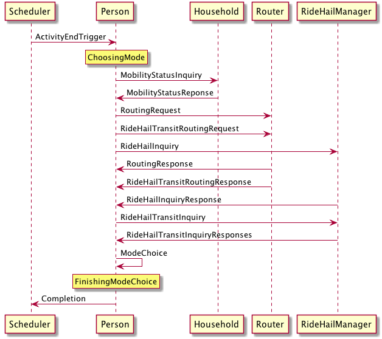
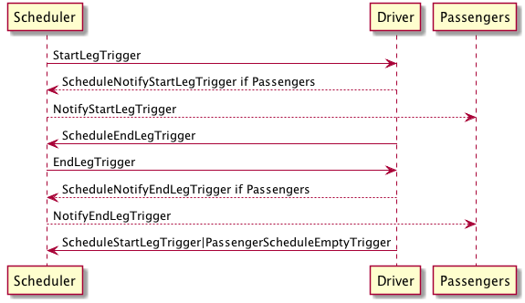
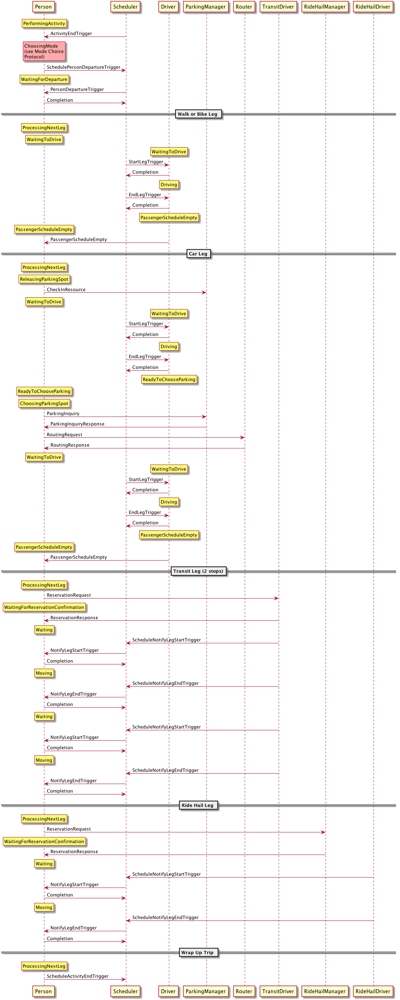
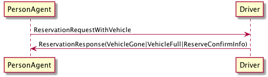
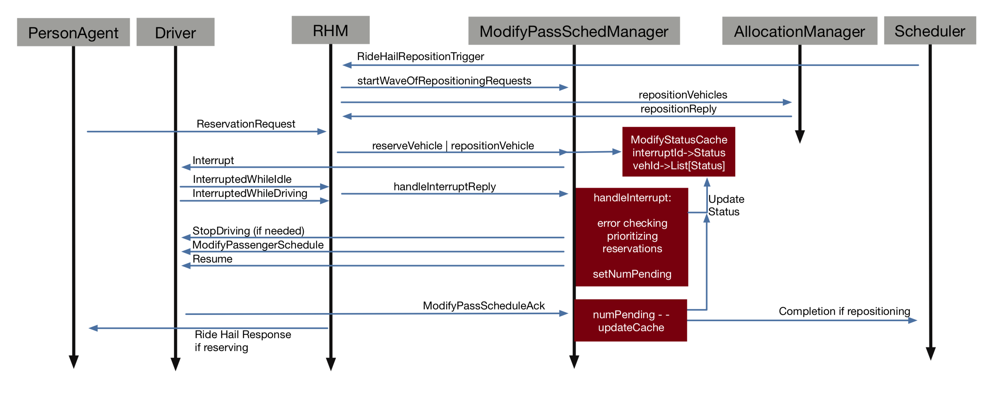

Protocols
=========

Because BEAM is implemented using the Actor framework and simulations are executed asynchronously, there are many communications protocols between Actors and Agents that must be specified and followed. The following describes the key protocols with diagrams and narrative.

Trip Planning
-------------

RoutingRequests
~~~~~~~~~~~~~~~

One of the more familiar protocols, any Actor can consult the router service for routing information by sending a RoutingRequest and receiving a RoutingResponse. 

The RoutingRequest message contains:

* Departure Window
* Origin / Destination
* Transit Modes to Consider
* Vehicles to Consider (their Id, Location, Mode)
* The Id of the Person for whom the request is ultimately made

The RoutingResponse message contains:

* A vector of EmbodiedBeamTrips
  
EmbodiedBeamTrips contain:

* A trip classifer (i.e. the overall mode for the trip which is restricted to WALK, BIKE, CAR, RIDE_HAIL, TRANSIT)
* A vector of EmbodiedBeamLegs 

EmbodiedBeamLegs contain:

* A BeamLeg
* A BeamVehicle Id
* As Driver Boolean
* Optional PassengerSchedule
* Cost
* UnbecomeDriveOnCompletion Boolean

BeamLegs contain:

* Start time
* Mode (this is a more specific mode for Transit, e.g. SUBWAY or BUS)
* Duration
* BeamPath containing the path used through the network.

BeamPaths contain:

* Vector of link Ids
* Optional transit stop info (for any Transit leg, the boarding and alighting stop)
* A trajectory resolver which is resposible for translating the linkIds into coordinates

BeamTransitSegments contain:

* Origin stop 
* Destination stop

ChoosesMode
~~~~~~~~~~~~~~~
The mode choice protocol involves gathering information, making a choice, confirming reservations if necessary, and then adapting if the chosen trip cannot be executed.

*Gathering Information*

1. The Person receives the BeginModeChoiceTrigger from the scheduler.
2. Person sends a MobilityStatusInquiry to thier Household.
3. Household returns a MobilityStatusResponse. Based on this response, the person optionally includes vehicles in the ReservationRequest sent to the Router.
4. Person sends a ReservationRequest to the Router.
5. Person sends a RideHailInquiry to the RideHailManager.
6. Person schedules a FinalizeModeChoiceTrigger to occur in the future (respresenting non-zero time to make a choice).
7. Person stays in ChoosingMode state until all results are recieved: RoutingResponse, RideHailingInquiryResponse, FinalizeModeChoiceTrigger. With each response, the data is stored locally for use in the mode choice.

*Choosing and Reserving*

1. The Person evaluates the ModeChoiceCalculator which returns a chosen itinerary (in the form of an EmboidedBeamTrip) from the list of possible alternatives.
2. If a reservation is required to accomplish the chosen itinerary, the person sends ReservationRequest to all drivers in the itinerary (in the case of a transit trip) or a ReserveRide message to the RideHailManager in the case of a ride hail trip).
3. If reservation requests were sent, the Person waits (still in ChoosingMode state) for all responses to be returned. If any response is negative, the Person removes the chosen itinerary from their choice set, sends RemovePassengerFromTrip messagse to all drivers in the trip (if transit) and begins the mode choice process anew.
4. If all reservation responses are received and positive or if the trip does not require reservations at all, the person releases any reserved personal vehicles by sending ReleaseVehicleReservation messags to the Household and a ResourceIsAvailableNotification to themself, the Person throws a PersonDepartureEvent and finally schedules a PersonDepartureTrigger to occur at the departure time of the trip.

Traveling
---------

When a PersonAgent travels, she may transition from being a driver of a vehicle to being a passenger of a vehicle. The protocol for being a driver of a vehicle is listed separately below because that logic is implemented in its own trait (DrivesVehicle) to allow BeamAgents other than PersonAgents to drive vehicles. Some agents (e.g. TransitDrivers) may not be Persons and therefore do not "travel" but they do of course operate a vehicle and move around with it.

Driver
~~~~~~

.. image:: _static/uml/DrivesVehicleFSM.png
   :width: 300 px

*Starting Leg*

1. The Driver receives a StartLegTrigger from the Waiting state.
2. The Driver schedules NotifyLegStartTriggers for each rider in the PassengerSchedule associated with the current BeamLeg.
3. The Driver creates a list of borders from the PassengerSchedule associated with the BeamLeg to track which agents have yet to board the vehicle.
4. When all expected BoardVehicle messages are recieved by the Driver, the Driver schedules an EndLegTrigger and transitions to the Moving state.

*Ending Leg*

1. The Driver receives an EndLegTrigger from the Moving state.
2. The Driver schedules NotifyLegEndTriggers for all riders in the PassengerSchedule associated with the current BeamLeg.
3. The Driver creates a list of alighters from the PassengerSchedule associated with the BeamLeg to track which agents have yet to alight the vehicle.
4. When all expected AlightingConfirmation messages are recieved from the vehicle, the Driver publishes a PathTraversalEvent and proceeds with the following steps.
5. If the Driver has more legs in the PassengerSchedule, she schedules a StartLegTrigger based on the start time of that BeamLeg.
6. Else the Driver schedules a PassengerScheduleEmptyTrigger to execute in the current tick.
7. The Driver transitions to the Waiting state.

Traveler
~~~~~~~~
.. image:: _static/uml/PersonAgentFSM.png

*Starting Trip*

1. The PersonAgent receives a PersonDepartureTrigger from the scheduler while in Waiting state. She executes the ProcessNextLeg Method described below.

*ProcessNextLeg Method*

The following protocol is used more than once by the traveler so it is defined here as a function with no arguments.

1. The Person checks the value of _currentEmbodiedLeg to see if unbecomeDriverOnCompletion is set to TRUE, if so, then the Person sends an UnbecomeDriver message to her vehicle and updates her _currentVehicle accordingly.
2. If there are no more legs in the EbmodiedBeamTrip, the PersonAgent either schedules the ActivityEndTrigger and transitions to the PerformingActivity state or, if there are no remaining activities in the person's plan, she transitions to the Finished state and schedules no further triggers. 
3. If there are more legs in the EmbodiedBeamTrip, the PersonAgent processes the next leg in the trip. If asDriver for the next leg is FALSE, then the Person transitions to Waiting state and does nothing further.
4. If asDriver is true for the next leg, the Person creates a temporary passenger schedule for the next leg and sends it along with a BecomeDriver or a ModifyPassnegerSchedule message, depending on whether this person is already the driver of the vehicle or if becoming the driver for the first time.
5. The person stays in the current state (which could be Waiting or Moving depending on the circumstances).

*Driving Mission Completed*

1. The PersonAgent receives a PassengerScheduleEmptyTrigger from the scheduler which indicates that as a driver, this Person has finished all legs in her PassengerSchedule.
2. The PersonAgent executes the ProcessNextLeg method.

*Notify Start Leg*

1. The PersonAgent receives a NotifyLegStartTrigger.
2. If the private field _currentEmbodiedLeg is non-empty or if the leg referred to in the trigger does not match the Person's next leg or if the Person's next leg has asDriver set to TRUE, this Person has received the NotifyLegStartTrigger too early, so she reschedules the NotifyLegStartTrigger to occur in the current tick, allowing other messages in her Actor mailbox to be processed first.
3. Otherwise, the PersonAgent sends an BoardVehicle message to the driver contained in the EmbodiedBeamLeg unless she is already a passenger in that vehicle.
4. The PersonAgent transitions to the Moving state.

*Notify End Leg* 

1. The PersonAgent receives a NotifyLegEndTrigger.
2. If the private field _currentEmbodiedLeg is empty or the currentBeamLeg does not match the leg associated with the Trigger, this Person has received the NotifyLegEndTrigger too early, so she reschedules the NotifyLegEndTrigger to occur in the current tick, allowing other messages in her Actor mailbox to be processed first.
3. If another EmbodiedBeamLeg exists in her EmbodiedBeamTrip AND the BeamVehicle associated with the next EmbodiedBeamTrip is identical to the curren BeamVehicle, then she does nothing other than update her internal state to note the end of the leg and transition to Waiting.
4. Else she sends the current driver an AlightVehicle message and executes the ProcessNextLegModule method.

Household
---------

During initialization, we execute the rank and escort heuristc. Escorts and household vehicles are assigned to members.

1. The PersonAgent retrieves mobility status from her Household using a MobilityStatusInquiry message.
2. Household returns a MobilityStatusReponse message which notifies the person about two topics: a) whether she is an escortee (e.g. a child), an estorter (e.g. a parent), or traveling alone; b) the Id and location of at most one Car and at most one Bike that the person may use for their tour.
3. If the PersonAgent is an escortee, then she will enter a waiting state until she receives a AssignTrip message from her escorter which contains the BeamTrip that she will follow, at which point she schedules a PersonDepartureTrigger.
4. Else the PersonAgent goes through the mode choice process. After choosing a BeamTrip, she sends an appropriate BeamTrip to her escortees using the AssignTrip message.
5. The PersonAgent sends a VehicleConfirmationNotice to the Household, confirming whether or not she is using the Car or Bike. The Household will use this information to offer unused vehicles as options to subsequent household members.

Escort
~~~~~~

RideHailing
------------

The process of hailing a ride from a TNC is modeled after the real-world experience:

1. The PersonAgent inquires about the availability and pricing of the service using a RideHailingInquiry message. 
2. The RideHailingManager responds with a RideHailingInquiryResponse. 
3. The PersonAgent may choose to use the ride hailing service in the mode choice process. 
4. The PersonAgent sends a ReserveRide message attempting to book the service.
5. The RideHailingManager responds with a ReservationResponse which either confirms the reservation or notifies that the resource is unavailable.

Inquiry
~~~~~~~

The RideHailingInquiry message contains:

* inquiryId
* customerId
* pickUpLocation
* departAt time 
* destinationLocation

The RideHailingInquiryResponse message contains:

* inquiryId
* a Vector of TravelProposals
* an optional ReservationError

Each TravelProposal contains:

* RideHailingAgentLocation
* Time to Customer
* estimatedPrice
* estimatedTravelTime
* Route to customer
* Route from origin to destination

Reserve
~~~~~~~
The ReserveRide message contains:

* inquiryId
* customerId in the form of a VehiclePersonId
* pickUpLocation
* departAt time
* destinationLocation)

The ReservationResponse message contains the request Id and either a ReservationError or f the reservation is successfull, a ReserveConfirmInfo object with the following:

* DepartFrom BeamLeg.
* ArriveTo BeamLeg.
* PassengerVehicleId object containin the passenger and vehicle Ids.
* Vector of triggers to schedule.

Transit
-------

Transit itineraries are returned by the router in the Trip Planning Protocol. In order to follow one of these itineraries, the PersonAgent must reserve a spot on the transit vehicle according to the following protocol:

1. PersonAgent sends ReservationRequest to the Driver.
2. The BeamVehicle forwards the reservation request to the Driver of the vehicle. The driver is responsible for managing the schedule and accepting/rejecting reservations from customers.
3. The Driver sends a ReservationConfirmation directly to the PersonAgent.
4. When the BeamVehicle makes it to the confirmed stop for boarding, the Driver sends a BoardingNotice to the PersonAgent.
5. The PersonAgent sends an BoardVehicle message to the Driver.
7. Also, concurrently, when the BeamVehicle is at the stop, the Driver sends an AlightingNotice to all passengers registered to alight at that stop.
8. Notified passengers send an AlightVehicle message to the Driver.

Because the reservation process ensures that vehicles will not exceed capacity, the Driver need not send an acknowledgement to the PersonAgent.

Refueling
---------

???

Modify Passenger Schedule Manager
---------------------------------

This protocol is deep into the weeds of the Ride Hail Manager but important for understanding how reservations and reposition requests are managed.

