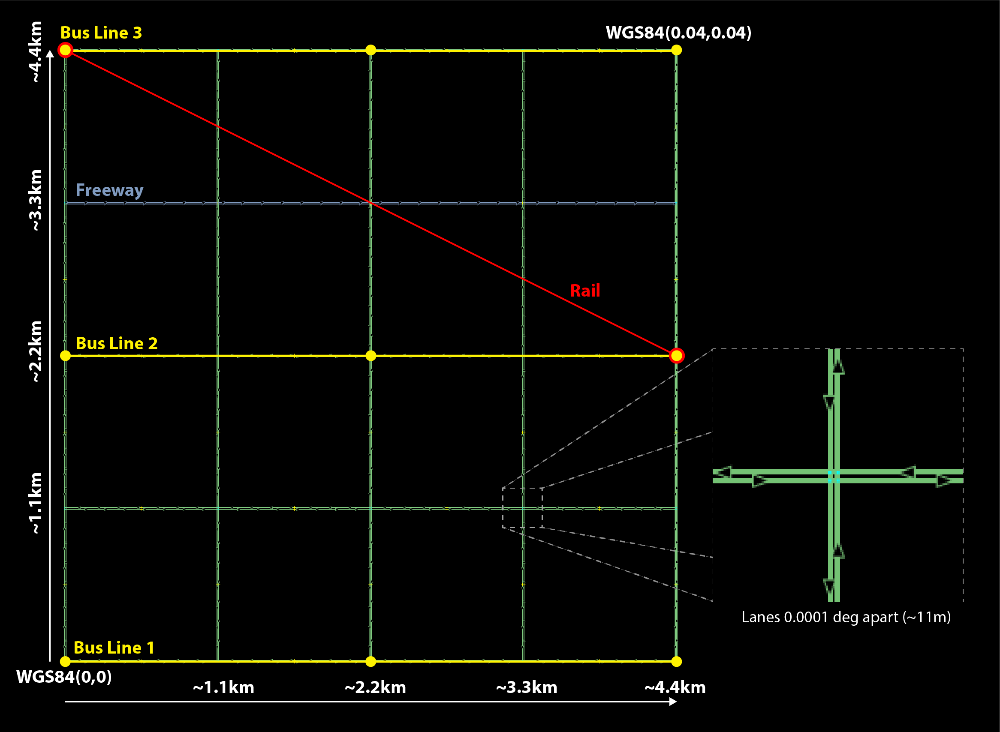
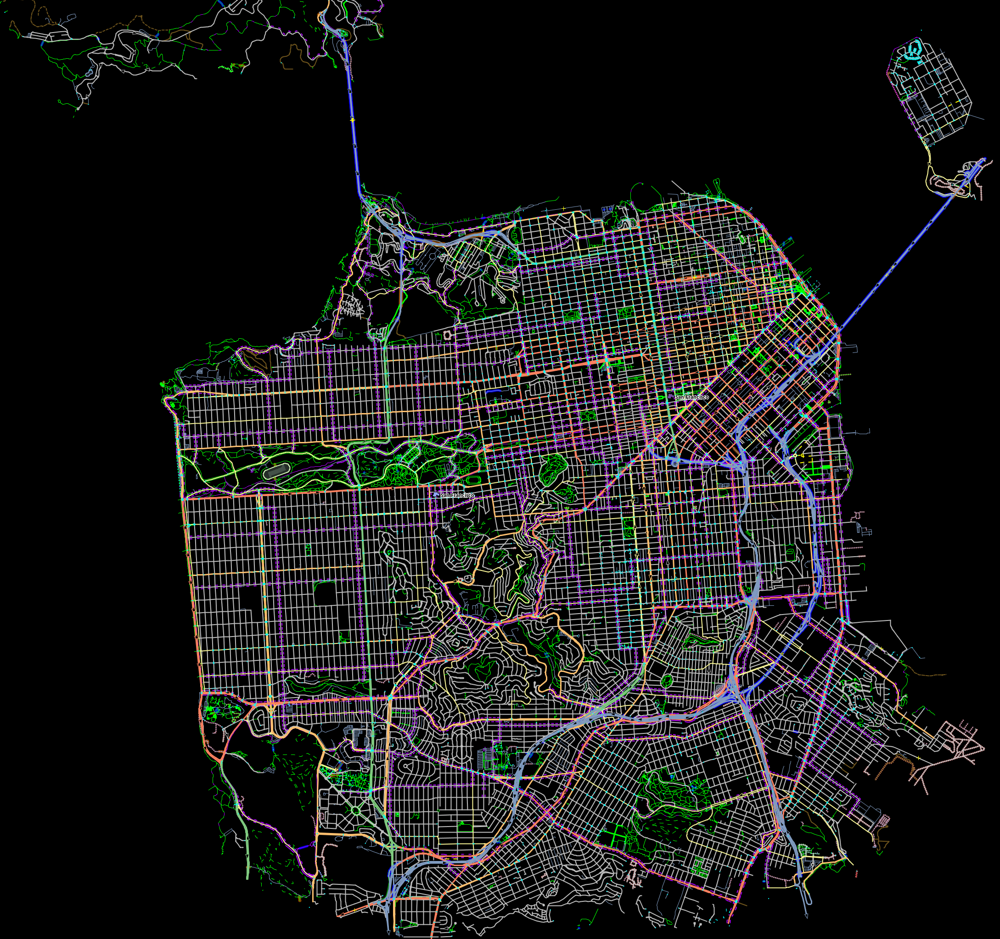
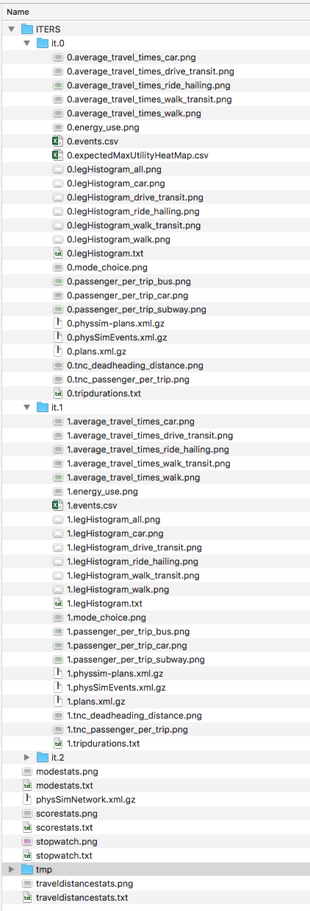

User's Guide
============

Getting Started
---------------
The following guide is designed as a demonstration of using BEAM and involves running the model on a scaled population and transportation system. This is the ideal place to familiarize yourself with the basics of configuring and running BEAM as well as doing small scale tests and analysis. 

For more advanced utilization or to contribute to the BEAM project, see the :ref:`developers-guide`.

System Requirements
^^^^^^^^^^^^^^^^^^^

* At least 8GB RAM
* Windows, Mac OSX, Linux
* Java Runtime Environment or Java Development Kit 1.8
* To verify your JRE: https://www.java.com/en/download/help/version_manual.xml
* To download JRE 1.8 (AKA JRE 8): http://www.oracle.com/technetwork/java/javase/downloads/jre8-downloads-2133155.html
* We also recommend downloading the VIA vizualization app and obtaining a free or paid license: https://simunto.com/via/
* Git and Git-LFS

Prerequisites :
^^^^^^^^^^^^^^^

**Install Java**

BEAM requires Java 1.8 JDK / JRE to be installed. If a different version of java is already installed on your system, please upgrade the version to 1.8.
See this `link <https://www.java.com/en/download/help/version_manual.xml>`_ for steps to check the current version of your JRE.

If java is not already installed on your system , please follow this `download manual <https://www.java.com/en/download/manual.jsp>`_ to install java on your system.

Please note that BEAM is currently compatible only with Java 1.8 and is not compatible with any of the older or recent versions.

**Install Gradle**

BEAM uses `gradle <https://gradle.org>`_ as its build tool. If gradle is not already installed, check this `gradle installation guide <https://gradle.org/install>`_ for steps on how to download and install gradle.
Once gradle is successfully installed , verify the installation by running the command

.. code-block:: bash

    gradle

GIT-LFS Configuration
^^^^^^^^^^^^^^^^^^^^^

The installation process for git-lfs client(`v2.3.4`_, latest installer has some issue with node-git-lfs) is very simple. For detailed documentation please consult `github guide`_ for Mac, windows and Linux.

.. _v2.3.4: https://github.com/git-lfs/git-lfs/releases/tag/v2.3.4
.. _github guide: https://help.github.com/articles/installing-git-large-file-storage/

To verify successful installation, run following command::

    $ git lfs install
    Git LFS initialized.

To confirm that you have installed the correct version of client run the following command::

   $ git lfs env

It will print out the installed version, and please make sure it is `git-lfs/2.3.4`.

To update the text pointers with the actual contents of files, run the following command (if it requests credentials, use any username and leave the password empty)::

   $ git lfs pull
   Git LFS: (98 of 123 files) 343.22 MB / 542.18 MB

**Installing git lfs on windows :**

With Git LFS windows installation, it is common to have the wrong version of git-lfs installed, because in these latest git client version on windows, git lfs comes packaged with the git client.

When installing the git client one needs to uncheck git lfs installation. If mistakenly you installed git lfs with the git client, the following steps are needed to correct it (uninstalling git lfs and installing the required version does not work...):

    * Uninstall git
    * Install the git client (uncheck lfs installation)
    * Install git lfs version 2.3.4 separately

Another alternative to above is to get the old git-lfs.exe from the release archives and replace the executable found in

`[INSTALL PATH]\\mingw6\\bin` and `[INSTALL PATH]\\cmd`, where the default installation path usually is `C:\\Program Files\\Git`

Installing BEAM
^^^^^^^^^^^^^^^

Clone the beam repository::

   git clone git@github.com:LBNL-UCB-STI/beam.git

Change directories into that repository::

   cd beam

Fetch the remote branches and tags::

    git fetch

Now checkout the latest stable version of BEAM, v0.7.0::

   git checkout v0.7.0

Run the gradle command to compile BEAM, this will also downloaded all required dependencies automatically::

   gradle classes

Now you're ready to run BEAM! 

Running BEAM
^^^^^^^^^^^^

Inside of the respository is a folder 'test/input' containing several scenarios and configurations you can experiment with.

The simplest, smallest, and fastest is the beamville scenario (described below). Try to run beamville with this command::

  ./gradlew :run -PappArgs="['--config', 'test/input/beamville/beam.conf']"

The BEAM application by default sets max RAM allocation to 140g (see **maxRAM** setting in gradle.properties). This needs to
be adjusted based on the available memory on your system.

The max allocatable RAM value can be overriden by setting the environment variable **MAXRAM** to the required value.

On Ubuntu , the environment variable can be set using the below command :

.. code-block:: bash

    export MAXRAM=10g

where 10g = 10GB

Similarly on windows it can be set using the below command :

.. code-block:: bash

    setx MAXRAM="10g"

The outputs are written to the 'output' directory, should see results appear in a sub-folder called "beamville_%DATE_TIME%".

Optionally you can also run BEAM from your favourite IDE . Check the below section on how to configure and run BEAM using Intellij IDEA.

Running BEAM with Intellij IDE
^^^^^^^^^^^^^^^^^^^^^^^^^^^^^^

IntelliJ IDEA community edition is an open source IDE available for free. It can be downloaded from `here <https://www.jetbrains.com/idea/download/#section=windows>`_

After successful download , run the executable and follow the installation wizard to install Intellij IDEA.

When running the IDE for the first time , it asks to import previous settings (if any) from a local path, if no previous settings to choose , select "Do not import settings" and click Ok.

**Importing BEAM project into IDE**

Once the IDE is successfully installed , proceed with the below steps to import BEAM into the IDE.

1. Open the IDE and agree to the privacy policy and continue
     (Optional) IDEA walks you through some default configurations set up here . In case you want to skip these steps , choose "Skip and install defaults" and go to step 2
      * Select a UI theme of choice and go to Next: Default Plugins
      * Select only the required plugins (gradle , java are mandatory) and disable the others and go to Next:Feature plugins
      * Install scala and click "Start using Intellij IDEA"
2. In the welcome menu , select "Import Project" and provide the location of the locally cloned BEAM project
3. Inside the import project screen, select "Import project from external model" and choose "Gradle" from the available and click Next
4. Click Finish.

The project should now be successfully imported into the IDE and a build should be initiated automatically. If no build is triggered automatically , you can manually trigger one by going to Build > Build Project.

**Installing scala plugin**

If optional configuration in step 1 of above section was skipped , scala plugin will not be added automatically .
To manually enable scala plugin go to File > Settings > Plugins. Search for scala plugin and click Install.

**Setting up scala SDK**

Since BEAM is built with java/scala . A scala sdk module needs to be configured to run BEAM. Check the below steps on how to add a scala module to IDEA
* Go to File > Project Settings > Global Libraries
* Click + and select Scala SDK
* Select the required scala SDK from the list , if no SDK found click Create.
* Click "Browse" and select the scala home path or click "Download" (choose 2.12.x version)

**Running BEAM from IDE**

BEAM requires some arguments to be specified during run-time like the scenario configuration.
These configuration settings can be added as a run configuration inside the IDE.

Steps to add a new configuration :

* Go to Run > Edit Configurations
* Click + and from the templates list and select "Application"
* Fill in the following values

  * Main Class : beam.sim.RunBeam
  * VM options : -Xmx8g
  * Program Arguments : --config test/input/beamville/beam.conf (this runs beaamville scenario, changes the folder path to run a different scenario)
  * Working Directory : /home/beam/BEAM
  * Environment Variables : PWD=/home/beam/BEAM
  * use submodule of path : beam.beam.main
* Click Ok to save the configuration.

To add a configuration for a different scenario , follow the above steps and change the folder path to point to the required scenario in program arguments

Using grafana to view BEAM metrics
^^^^^^^^^^^^^^^^^^^^^^^^^^^^^^^^^^
`Grafana <https://grafana.com/>`_ is the open source analytics and monitoring solution and may be used to view various BEAM metrics in real time during BEAM execution.
There are various grafana dashboards which include:

* dashboards with per-hour metrics
* dashboards with per-iteration metrics
* dashboards to compare two different BEAM iterations or two runs
* dashboard with a metrics displayed on a map

**Setting up**

Grafana is controlled with gradle commands, those commands under hood are using docker and docker-compose, so, one should have docker installed and running.

* For Windows and Mac users it is enough to install `docker-desktop <https://www.docker.com/products/docker-desktop>`_
* Ubuntu/Debian users should install those packages: docker-ce docker-ce-cli containerd.io docker-compose

**Start Grafana**

To run Grafana one should use gradle command grafanaStart without any parameters. The command will start Grafana and InfluxDB docker container, configure them and print all five URLs to Grafana dashboards after the docker image is running. ::

    ./gradlew grafanaStart

After that command execution one may run BEAM multiple times, all data will be stored in the InfluxDB database. And all data may be viewed in Grafana dashboards.

**Stop Grafana**

To stop Grafana one should use gradle command grafanaStop without any parameters. ::

    ./gradlew grafanaStop

**Clean collected data**

To clear all collected by Grafana and InfluxDB data from BEAM runs one should use gradle command grafanaClearData ::

    ./gradlew grafanaClearData

**Troubleshooting**

ERROR: for docker-influxdb-grafana  Cannot create container for service docker-influxdb-grafana: Conflict. The container name "/docker-influxdb-grafana" is already in use by container "<CONTAINER ID>”. You have to remove (or rename) that container to be able to reuse that name.

This error means that one already has a container with name ‘philhawthorne/docker-influxdb-grafana’ in docker. To coupe with that one may remove that container.

Solution:

* Run command to get a container ID for docker-influxdb-grafana container ::

    docker ps -a

* Run ::

    docker container stop <container ID>
    docker rm <container ID>

Scenarios
^^^^^^^^^
We have provided two scenarios for you to explore under the `test/input` directory.

The `beamville` test scenario is a toy network consisting of a 4 x 4 block gridded road network, a light rail transit agency, a bus transit agency, and a population of ~50 agents.

The `sf-light` scenario is based on the City of San Francisco, including the SF Muni public transit service and a range of sample populations from 1000 to 25,000 agents.

Inputs
^^^^^^^

For more detailed inputs documentation, see :ref:`model-inputs`.

BEAM follows the `MATSim convention`_ for most of the inputs required to run a simulation, though some inputs files can alternatively be provided in CSV instead of XML format. Also, the road network and transit system inputs are based on the `R5 requirements`_. The following is a brief overview of the minimum requirements needed to conduct a BEAM run. 

.. _MATSim convention: http://archive.matsim.org/docs
.. _R5 requirements: https://github.com/conveyal/r5

* A configuration file (e.g. `beam.conf`)
* The person population and corresponding attributes files (e.g. `population.xml` and `populationAttributes.xml`)
* The household population and corresponding attributes files (e.g. `households.xml` and `householdAttributes.xml`)
* The personal vehicle fleet (e.g. `vehicles.csv`)
* The definition of vehicle types including for personal vehicles and the public transit fleet (e.g. `vehicleTypes.csv`)
* A directory containing network and transit data used by R5 (e.g. `r5/`)
* The open street map network (e.g. `r5/beamville.osm`)
* GTFS archives, one for each transit agency (e.g. `r5/bus.zip`)

Outputs
^^^^^^^
At the conclusion of a BEAM run using the default `beamville` scenario, the output files in the should look like this when the run is complete:

Each iteration of the run produces a sub-folder under the `ITERS` directory. Within these, several automatically generated outputs are written including plots of modal usage, TNC dead heading, and energy consumption by mode. 

In addition, raw outputs are available in the two events file (one from the AgentSim and one from the PhysSim, see :ref:`matsim-events` for more details), titled `%ITER%.events.csv` and `%ITER%.physSimEvents.xml.gz` respectively.

Model Config
^^^^^^^^^^^^

To get started, we will focus your attention on a few of the most commonly used and useful configuration parameters that control beam::

  # Ride Hailing Params
  beam.agentsim.agents.rideHail.initialization.procedural.numDriversAsFractionOfPopulation=0.05
  beam.agentsim.agents.rideHail.defaultCostPerMile=1.25
  beam.agentsim.agents.rideHail.defaultCostPerMinute=0.75
  # Scaling and Tuning Params; 1.0 results in no scaling
  beam.agentsim.tuning.transitCapacity = 0.2
  beam.agentsim.tuning.transitPrice = 1.0
  beam.agentsim.tuning.tollPrice = 1.0
  beam.agentsim.tuning.rideHailPrice = 1.0

* numDriversAsFractionOfPopulation - Defines the # of ride hailing drivers to create. Drivers begin the simulation located at or near the homes of existing agents, uniformly distributed.
* defaultCostPerMile - One component of the 2 part price of ride hail calculation.
* defaultCostPerMinute - One component of the 2 part price of ride hail calculation.
* transitCapacity - Scale the number of seats per transit vehicle... actual seats are rounded to nearest whole number. Applies uniformly to all transit vehilces.
* transitPrice - Scale the price of riding on transit. Applies uniformly to all transit trips.
* tollPrice - Scale the price to cross tolls.
* rideHailPrice - Scale the price of ride hailing. Applies uniformly to all trips and is independent of defaultCostPerMile and defaultCostPerMinute described above. I.e. price = (costPerMile + costPerMinute)*rideHailPrice

Experiment Manager
------------------

BEAM features a flexible experiment manager which allows users to conduct multi-factorial experiments with minimal configuration. The tool is powered by Jinja templates ( see more http://jinja.pocoo.org/docs/2.10/).

We have created two example experiments to demonstrate how to use the experiment manager. The first is a simple 2-factorial experiment that varies some parameters of scientific interest. The second involves varying parameters of the mode choice model as one might do in a calibration exercise. 

In any experiment, we seek to vary the parameters of BEAM systematically and producing results in an organized, predicable location to facilitate post-processing. For the two factor experiment example, we only need to vary the contents of the BEAM config file (beam.conf) in order to achieve the desired anlaysis.

Lets start from building your experiment definitions in experiment.yml ( see example in `test/input/beamville/example-experiment/experiment.yml`).
`experiment.yml` is a YAML config file which consists of 3 sections: header, defaultParams, and factors.

The Header defines the basic properties of the experiment, the title, author, and a path to the configuration file (paths should be relative to the project root)::

  title: Example-Experiment
  author: MyName
  beamTemplateConfPath: test/input/beamville/beam.conf

The Default Params are used to override any parameters from the BEAM config file for the whole experiment. These values can, in turn, be overridden by factor levels if specified. This section is mostly a convenient way to ensure certain parameters take on specific values without modifying the BEAM config file in use.

Experiments consist of 'factors', which are a dimension along which you want to vary parameters. Each instance of the factor is a level. In our example, one factor is "transitCapacity" consisting of two levels, "Low" and "High". You can think about factors as of main influencers (or features) of simulation model while levels are discrete values of each factor.

Factors can be designed however you choose, including adding as many factors or levels within those factors as you want. E.g. to create a 3 x 3 experimental design, you would set three levels per factor as in the example below::

  factors:
    - title: transitCapacity
      levels:
      - name: Low
        params:
          beam.agentsim.tuning.transitCapacity: 0.01
      - name: Base
        params:
          beam.agentsim.tuning.transitCapacity: 0.05
      - name: High
        params:
          beam.agentsim.tuning.transitCapacity: 0.1

    - title: ridehailNumber
      levels:
      - name: Low
        params:
          beam.agentsim.agents.rideHail.numDriversAsFractionOfPopulation: 0.001
      - name: Base
        params:
          beam.agentsim.agents.rideHail.numDriversAsFractionOfPopulation: 0.01
      - name: High
        params:
          beam.agentsim.agents.rideHail.numDriversAsFractionOfPopulation: 0.1

Each level and the baseScenario defines `params`, or a set of key,value pairs. Those keys are either property names from beam.conf or placeholders from any template config files (see below for an example of this). Param names across factors and template files must be unique, otherwise they will overwrite each other.

In our second example (see directory `test/input/beamville/example-calibration/`), we have added a template file `modeChoiceParameters.xml.tpl` that allows us to change the values of parameters in BEAM input file `modeChoiceParameters.xml`. In the `experiment.yml` file, we have defined 3 factors with two levels each. One level contains the property `mnl_ride_hail_intercept`, which appears in modeChoiceParameters.xml.tpl as `{{ mnl_ride_hail_intercept }}`. This placeholder will be replaced during template processing. The same is true for all properties in the defaultParams and under the facts. Placeholders for template files must NOT contain the dot symbol due to special behaviour of Jinja. However it is possible to use the full names of properties from `beam.conf` (which *do* include dots) if they need to be overridden within this experiment run.

Also note that `mnl_ride_hail_intercept` appears both in the level specification and in the baseScenario. When using a template file (versus a BEAM Config file), each level can only override properties from Default Params section of `experiment.yml`.

Experiment generation can be run using following command::

  gradle -PmainClass=beam.experiment.ExperimentGenerator -PappArgs="['--experiments', 'test/input/beamville/example-experiment/experiment.yml']" execute

It's better to create a new sub-folder folder (e.g. 'calibration' or 'experiment-1') in your data input directory and put both templates and the experiment.yml there.
The ExperimentGenerator will create a sub-folder next to experiment.yml named `runs` which will include all of the data needed to run the experiment along with a shell script to execute a local run. The generator also creates an `experiments.csv` file next to experiment.yml with a mapping between experimental group name, the level name and the value of the params associated with each level. 

Within each run sub-folder you will find the generated BEAM config file (based on beamTemplateConfPath), any files from the template engine (e.g. `modeChoiceParameters.xml`) with all placeholders properly substituted, and a `runBeam.sh` executable which can be used to execute an individual simulation. The outputs of each simulation will appear in the `output` subfolder next to runBeam.sh

Calibration
-----------

This section describes calibrating BEAM simulation outputs to achieve real-world targets (e.g., volumetric traffic
counts, mode splits, transit boarding/alighting, etc.). A large number of parameters affect simulation behavior in
complex ways such that grid-search tuning methods would be extremely time-consuming. Instead, BEAM uses SigOpt_,
which uses Bayesian optimization to rapidly tune scenarios as well as analyze the sensitivity of target metrics to
parameters.

Optimization-based Calibration Principles
^^^^^^^^^^^^^^^^^^^^^^^^^^^^^^^^^^^^^^^^^
At a high level, the SigOpt service seeks to find the *optimal value*, :math:`p^*` of an *objective*,
:math:`f_0: \mathbb{R}^n\rightarrow\mathbb{R}`, which is a function of a vector of *decision variables*
:math:`x\in\mathbb{R}^n` subject to *constraints*, :math:`f_i: \mathbb{R}^n\rightarrow\mathbb{R}, i=1,\ldots,m`.

In our calibration problem, :math:`p^*` represents the value of a *metric* representing an aggregate measure of some
deviation of simulated values from real-world values. Decision variables are hyperparameters defined in the `.conf`
file used to configure a BEAM simulation. The constraints in this problem are the bounds within which it is believed
that the SigOpt optimization algorithm should search. The calibration problem is solved by selecting values of the
hyperparameters that minimize the output of the objective function.

Operationally, for each calibration attempt, BEAM creates an `Experiment` using specified `Parameter` variables,
their `Bounds`s, and the number of workers (applicable only when using parallel calibration execution) using the
SigOpt API. The experiment is assigned a unique ID and then receives a `Suggestion` (parameter values to simulate)
from the SigOpt API, which assigns a value for each `Parameter`. Once the simulation has completed, the metric (an
implementation of the `beam.calibration.api.ObjectiveFunction` interface) is evaluated, providing an `Observation`
to the SigOpt API. This completes one iteration of the calibration cycle. At the start of the next iteration new
`Suggestion` is returned by SigOpt and the simulation is re-run with the new parameter values. This process continues
for the number of iterations specified in a command-line argument.

 Note: that this is a different type of iteration from the number of iterations of a run of BEAM itself.
 Users may wish to run BEAM for several iterations of the co-evolutionary plan modification loop prior to
 evaluating the metric.

SigOpt Setup
^^^^^^^^^^^^

Complete the following steps in order to prepare your simulation scenarios for calibration with SigOpt:

1. `Sign up`_ for a SigOpt account (note that students and academic researchers may be able to take
advantage of `educational pricing`_ options).

2. `Log-in`_ to the SigOpt web interface.

3. Under the `API Tokens`_ menu, retrieve the **API Token** and **Development Token** add the tokens as
environmental variables in your execution environment with the keys `SIGOPT_API_TOKEN` and `SIGOPT_DEV_API_TOKEN`.

Configuration
^^^^^^^^^^^^^

Prepare YML File
~~~~~~~~~~~~~~~~

Configuring a BEAM scenario for calibration proceeds in much the same way as it does for an experiment using the
`Experiment Manager`_. In fact, with some minor adjustments, the `YAML` text file used to define experiments
has the same general structure as the one used to specify tuning hyperparameters and ranges for calibration
(see example file beam/test/input/beamville/example-calibration/experiment.yml)::

  title: this is the name of the SigOpt experiment
  beamTemplateConfPath: the config file to be used for the experiments
  modeChoiceTemplate: mode choice template file
  numWorkers: this defines for a remote run, how many parallel runs should be executed (number of machines to be started)
  params:
   ### ---- run template env variables ---####
   EXPERIMENT_MAX_RAM: 16g (might be removed in future)
   S3_OUTPUT_PATH_SUFFIX: "sf-light" (might be removed in future)
   DROP_OUTPUT_ONCOMPLETE: "true" (might be removed in future)
   IS_PARALLEL: "false" (might be removed in future)

  runName: instance name for remote run
  beamBranch: branch name
  beamCommit: commit hash
  deployMode: "execute"
  executeClass: "beam.calibration.RunCalibration"
  beamBatch: "false"
  shutdownWait: "15"
  shutdownBehavior: "terminate"
  s3Backup: "true"
  maxRAM: "140g"
  region: "us-west-2"
  instanceType: "m4.16xlarge"

The major exceptions are the following:

* Factors may have only a single numeric parameter, which may (at the moment) only take two levels (High and Low). These act as bounds on the values that SigOpt will try for a particular decision variable.

* The level of parallelism is controlled by a new parameter in the header called `numberOfWorkers`. Setting its value above 1 permits running calibrations in parallel in response to multiple concurrent open `Suggestions`.

Create Experiment
~~~~~~~~~~~~~~~~~

Use `beam.calibration.utils.CreateExperiment` to create a new SigOpt experiment. Two inputs are needed for this:
a `YAML` file and a `benchmark.csv` file (this second parameter might be removed in the near future, as not needed).

After running the script you should be able to see the newly created experiment in the SigOpt web interface and
the experiment id is also printed out in the console.

Set in Config
~~~~~~~~~~~~~

One must also select the appropriate implementation of the `ObjectiveFunction` interface in the `.conf` file
pointed to in the `YAML`, which implicitly defines the metric and input files.
Several example implementations are provided such as `ModeChoiceObjectiveFunction`. This implementation
compares modes used at the output of the simulation with benchmark values. To optimize this objective, it is necessary
to have a set of comparison benchmark values, which are placed in the same directory as other calibration files::

  beam.calibration.objectiveFunction = "ModeChoiceObjectiveFunction_AbsolutErrorWithPreferrenceForModeDiversity"
  beam.calibration.mode.benchmarkFileLoc=${beam.inputDirectory}"/calibration/benchmark.csv"

(Needed for scoring funtions which try to match mode share).

Execution
^^^^^^^^^

Execution of a calibration experiment requires running the `beam.calibration.RunCalibration` class using the
following arguments:

--experiments   production/application-sfbay/calibration/experiment_counts_calibration.yml

--benchmark     Location of the benchmark file (production/applicaion-sfbay/calibration/benchmark.csv)

--num_iters     Number of SigOpt iterations to be conducted (in series).

--experiment_id     If an `experimentID` has already been defined, add it here to continue an experiment or put "None" to start a new experiment.

--run_type      Can be local or remote

Manage Experiment
^^^^^^^^^^^^^^^^^

As the number of open suggestions for an experiment is limited (10 in our case), we sometimes might need to cleanup
suggestions maually using `beam.calibration.utils.DeleteSuggestion` script to both delete specific and all open
suggestions (e.g. if there was an exception during all runs and need to restart).

.. _SigOpt: http://sigopt.com
.. _Sign up: http://sigopt.com/pricing
.. _educational pricing: http://sigopt.com/edu
.. _Log-in: http://app.sigopt.com/login
.. _API Tokens: http://app.sigopt.com/tokens/info

Timezones and GTFS
------------------
There is a subtle requirement in BEAM related to timezones that is easy to miss and cause problems. 

BEAM uses the R5 router, which was designed as a stand-alone service either for doing accessibility analysis or as a point to point trip planner. R5 was designed with public transit at the top of the developers' minds, so they infer the time zone of the region being modeled from the "timezone" field in the "agency.txt" file in the first GTFS data archive that is parsed during the network building process.

Therefore, if no GTFS data is provided to R5, it cannot infer the locate timezone and it then assumes UTC. 

Meanwhile, there is a parameter in beam, "beam.routing.baseDate" that is used to ensure that routing requests to R5 are send with the appropriate timestamp. This allows you to run BEAM using any sub-schedule in your GTFS archive. I.e. if your base date is a weekday, R5 will use the weekday schedules for transit, if it's a weekend day, then the weekend schedules will be used. 

The time zone in the baseDate parameter (e.g. for PST one might use "2016-10-17T00:00:00-07:00") must match the time zone in the GTFS archive(s) provided to R5.

As a default, we provide a "dummy" GTFS data archive that is literally empty of any transit schedules, but is still a valid GTFS archive. This archive happens to have a time zone of Los Angeles. You can download a copy of this archive here:

https://www.dropbox.com/s/2tfbhxuvmep7wf7/dummy.zip?dl=1

But in general, if you use your own GTFS data for your region, then you may need to change this baseDate parameter to reflect the local time zone there. Look for the "timezone" field in the "agency.txt" data file in the GTFS archive. 

The date specified by the baseDate parameter must fall within the schedule of all GTFS archives included in the R5 sub-directory. See the "calendar.txt" data file in the GTFS archive and make sure your baseDate is within the "start_date" and "end_date" fields folder across all GTFS inputs. If this is not the case, you can either change baseDate or you can change the GTFS data, expanding the date ranges... the particular dates chosen are arbitrary and will have no other impact on the simulation results.

One more word of caution. If you make changes to GTFS data, then make sure your properly zip the data back into an archive. You do this by selecting all of the individual text files and then right-click-compress. Do not compress the folder containing the GTFS files, if you do this, R5 will fail to read your data and will do so without any warning or errors.

Finally, any time you make a changes to either the GTFS inputs or the OSM network inputs, then you need to delete the file "network.dat" under the "r5" sub-directory. This will signal to the R5 library to re-build the network.

Converting a MATSim Scenario to Run with BEAM
---------------------------------------------

The following MATSim input data are required to complete the conversion process:

* Matsim network file: (e.g. network.xml)
* Matsim plans (or population) file: (e.g. population.xml)
* A download of OpenStreetMap data for a region that includes your region of interest. Should be in pbf format. For North American downloads: http://download.geofabrik.de/north-america.html

The following inputs are optional and only recommended if your MATSim scenario has a constrained vehicle stock (i.e. not every person owns a vehicle):

* Matsim vehicle definition (e.g. vehicles.xml) 
* Travel Analysis Zone shapefile for the region, (e.g. as can be downloaded from https://www.census.gov/geo/maps-data/data/cbf/cbf_taz.html)

Finally, this conversion can only be done with a clone of the full BEAM repository. Gradle commands will **not** work with releases: https://github.com/LBNL-UCB-STI/beam/releases

Conversion Instructions
^^^^^^^^^^^^^^^^^^^^^^^
Note that we use the MATSim Sioux Falls scenario as an example. The data for this scenario are already in the BEAM repository under "test/input/siouxfalls". We recommend that you follow the steps in this guide with that data to produce a working BEAM Sioux Falls scenario and then attempt to do the process with your own data.

1. Create a folder for your scenario in project directory under test/input (e.g: test/input/siouxfalls)

2. Create a sub-directory to your scenario directory and name it "conversion-input" (exact name required) 
   
3. Create a another sub-directory and name it "r5". 

4. Copy the MATSim input data to the conversion-input directory.

5. Copy the BEAM config file from test/input/beamville/beam.conf into the scenario directory and rename to your scenario (e.g. test/input/siouxfalls/siouxfalls.conf)

6. Make the following edits to siouxfalls.conf (or your scenario name, replace Sioux Falls names below with appropriate names from your case):

* Do a global search/replace and search for "beamville" and replace with your scenario name (e.g. "siouxfalls").
   
* matsim.conversion.scenarioDirectory = "test/input/siouxfalls"

* matsim.conversion.populationFile = "Siouxfalls_population.xml" (just the file name, assumed to be under conversion-input)

* matsim.conversion.matsimNetworkFile = "Siouxfalls_network_PT.xml"  (just the file name, assumed to be under conversion-input)

* matsim.conversion.generateVehicles = true (If true -- common -- the conversion will use the population data to generate default vehicles, one per agent)

* matsim.conversion.vehiclesFile = "Siouxfalls_vehicles.xml" (optional, if generateVehicles is false, specify the matsim vehicles file name, assumed to be under conversion-input)

* matsim.conversion.defaultHouseholdIncome (an integer to be used for default household incomes of all agents)

* matsim.conversion.osmFile = "south-dakota-latest.osm.pbf" (the Open Street Map source data file that should be clipped to the scenario network, assumed to be under conversion-input)

* matsim.conversion.shapeConfig.shapeFile (file name shape file package, e.g: for shape file name tz46_d00, there should be following files: tz46_d00.shp, tz46_d00.dbf, tz46_d00.shx)

* matsim.conversion.shapeConfig.tazIdFieldName (e.g. "TZ46_D00_I", the field name of the TAZ ID in the shape file)

* beam.spatial.localCRS = "epsg:26914" (the local EPSG CRS used for distance calculations, should be in units of meters and should be the CRS used in the network, population and shape files)

* beam.routing.r5.mNetBuilder.toCRS = "epsg:26914" (same as above)

* beam.spatial.boundingBoxBuffer = 10000 (meters to pad bounding box around the MATSim network when clipping the OSM network)

* The BEAM parameter beam.routing.baseDate has a time zone (e.g. for PST one might use "2016-10-17T00:00:00-07:00"). This time zone must match the time zone in the GTFS data provided to the R5 router. As a default, we provide the latest GTFS data from the City of Sioux Falls ("siouxareametro-sd-us.zip". downloaded from transitland.org) with a timezone of America/Central. But in general, if you use your own GTFS data for your region, then you may need to change this baseDate parameter to reflect the local time zone there. Look for the "timezone" field in the "agency.txt" data file in the GTFS archive. Finally, the date specified by the baseDate parameter must fall within the schedule of all GTFS archives included in the R5 sub-directory. See the "calendar.txt" data file in the GTFS archive and make sure your baseDate is within the "start_date" and "end_date" fields folder across all GTFS inputs. If this is not the case, you can either change baseDate or you can change the GTFS data, expanding the date ranges... the particular dates chosen are arbitrary and will have no other impact on the simulation results.

8. Run the conversion tool

* Open command line in beam root directory and run the following command, replace [/path/to/conf/file] with the path to your config file: gradlew matsimConversion -PconfPath=[/path/to/conf/file]

The tool should produce the following outputs:

* householdAttributes.xml
* households.xml
* population.xml
* populationAttributes.xml
* taz-centers.csv
* transitVehicles.xml
* vehicles.xml

9. Run OSMOSIS 

The console output should contain a command for the osmosis tool, a command line utility that allows you manipulate OSM data. If you don't have osmosis installed, download and install from: https://wiki.openstreetmap.org/wiki/Osmosis

Copy the osmosis command generated by conversion tool and run from the command line from within the BEAM project directory:

   osmosis --read-pbf file=/path/to/osm/file/south-dakota-latest.osm.pbf --bounding-box top=43.61080226522504 left=-96.78138443934351 bottom=43.51447260628691 right=-96.6915507011093 completeWays=yes completeRelations=yes clipIncompleteEntities=true --write-pbf file=/path/to/dest-osm.pbf

10. Run BEAM

* Main class to execute: beam.sim.RunBeam
* VM Options: -Xmx2g (or more if a large scenario)
* Program arguments, path to beam config file from above, (e.g. --config "test/input/siouxfalls/siouxfalls.conf")
* Environment variables: PWD=/path/to/beam/folder

Converting BEAM events file into MATSim events file
---------------------------------------------------

There is a script to convert BEAM events into MATSim events so, one can use Via to visualize BEAM simulation results.

The script will convert all PathTraversalEvents into sequence of various MATSim events.

There are, at least, two ways to run conversion:
 * directly run script from `beam/src/main/scala/beam/utils/beam_to_matsim/EventsByVehicleMode.scala`
 * run script by gradle task::

        gradle execute -PmainClass=beam.utils.beam_to_matsim.EventsByVehicleMode -PappArgs="[<parameters>]"

Both ways require four parameters:
 * BEAM events file path
 * MATSim output file path
 * Comma separated list of chosen vehicle modes
 * Vehicle population fraction for sampling

Example: `gradle execute -PmainClass=beam.utils.beam_to_matsim.EventsByVehicleMode -PappArgs="['BEAM events file path', 'output file path', 'car,bus', '1']" -PmaxRAM=16g`

If it is required to sample not by just population but also select only vehicles that passes through specific circle with center in X,Y and radius R then there are 4 optional arguments.
They should be provided together.

Parameters for circle sampling:
 * PhysSim network file path
 * X circle coordinate
 * Y circle coordinate
 * radius R of circle

Example: `gradle execute -PmainClass=beam.utils.beam_to_matsim.EventsByVehicleMode -PappArgs="['BEAM events file path', 'output file path', 'car,bus', '0.2', 'path to physSimNetwork.xml', '548966', '4179000', '5000']" -PmaxRAM=16g`

Worth noting the fact that running the script require sufficient amount of computing resources corresponding to source events file size.
For example: processing a BEAM file of 1.5Gb while selecting all vehicles (with fraction of 1) require about 16Gb memory for Java and takes about 12 minutes on modern laptop.
During transformation the script will provide additional information about computation progress.
