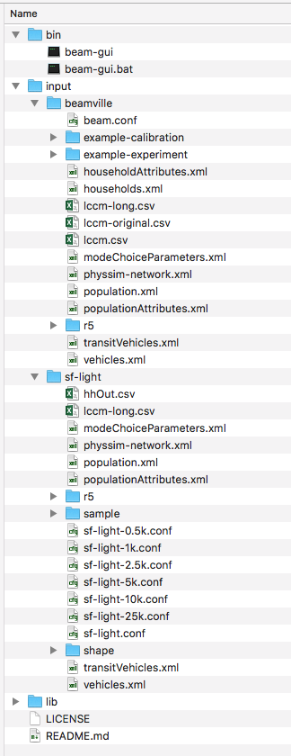
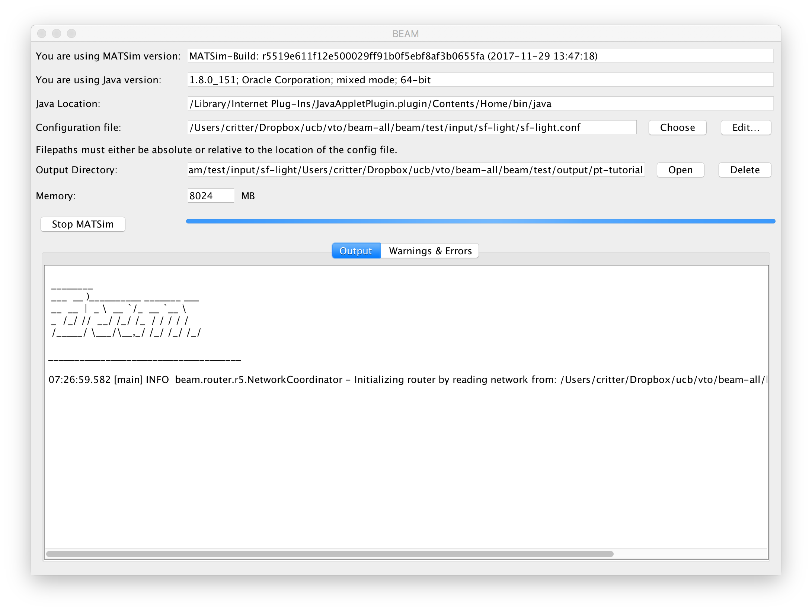

User's Guide
=================

Getting Started
---------------
The following guide is designed as a demonstration of using BEAM and involves running the model as an executable on a scaled population and transportation system. This is the ideal place to familiarize yourself with the basics of configuring and running BEAM as well as doing small scale tests and analysis. 

For more advanced utilization or to contribute to the BEAM project, see the :ref:`developers-guide`.

System Requirements
^^^^^^^^^^^^^^^^^^^

* At least 8GB RAM
* Windows, Mac OSX, Linux
* Java Runtime Environment 1.8
* To verify your JRE: https://www.java.com/en/download/help/version_manual.xml
* To download JRE 1.8 (AKA JRE 8): http://www.oracle.com/technetwork/java/javase/downloads/jre8-downloads-2133155.html
* We also recommend downloading Senozon VIA and obtaining a Free License: https://via.senozon.com/download

Installing
^^^^^^^^^^

Download `BEAM v0.5`_.

.. _BEAM v0.5: https://github.com/LBNL-UCB-STI/beam/releases/download/v0.5.0/beam-gui.zip

After you unzip the archive, you will see a directory that looks like this when partially expanded: 

For Windows, double click `bin/beam-gui.bat`, on UNIX-like systems, double-click `bin/beam-gui`.

Running BEAM
^^^^^^^^^^^^
The BEAM GUI app is the simplest way to run the model. It looks like this:

Use "Choose" to select a configuration file from your file system. Choose `test/input/beamville/beam.conf`.

Click "Run BEAM". 

You will see output appear in the console. Congrats, you're running BEAM! 

Click "Open" next to the Output Directory text box and you should see results appear in a sub-folder called "beamville_%DATE_TIME%".

You can also run bean using command line with a gradle task and configuration need to provide in `appArgs` (as gradle argument). To run for beamville, following command need to execute::

  ./gradlew :run -PappArgs="['--config', 'test/input/beamville/beam.conf']"

Scenarios
^^^^^^^^^
We have provided two scenarios for you to explore under the `input` directory.

The `beamville` test scenario is a toy network consisting of a 4 x 4 block gridded road network, a light rail transit agency, a bus transit agency, and a population of ~50 agents.

.. image:: _static/figs/beamville-net.png

The `sf-light` scenario is based on the City of San Francisco, including the SF Muni public transit service and a range of sample populations from 500 to 25,000 agents.

.. image:: _static/figs/sf-light.png

Inputs
^^^^^^^

BEAM follows the `MATSim convention`_ for most of the inputs required to run a simulation, though specifying the road network and transit system is based on the `R5 requirements`_. The following is a brief overview of the minimum requirements needed to conduct a BEAM run. 

.. _MATSim convention: http://archive.matsim.org/docs
.. _R5 requirements: https://github.com/conveyal/r5

* A configuration file (e.g. `beam.conf`)
* The person population and corresponding attributes files (e.g. `population.xml` and `populationAttributes.xml`)
* The household population and corresponding attributes files (e.g. `households.xml` and `householdAttributes.xml`)
* The personal vehicle fleet (e.g. `vehicles.xml`)
* The definition of vehicle types for the public transit fleet (e.g. `transitVehicles.xml`)
* The mode choice parameters file (e.g. `modeChoiceParameters.xml`)
* A directory containing network and transit data used by R5 (e.g. `r5/`)
* The open street map network (e.g. `r5/beamville.osm`)
* GTFS archives, one for each transit agency (e.g. `r5/bus.zip`)

Outputs
^^^^^^^
At the conclusion of a BEAM run using the default `beamville` scenario, you will see outputs written to the location as listed in the "Output Directory" text box. The files you in the output sub-folder should look like this when the run is complete:

.. image:: _static/figs/beamville-outputs.png

Each iteration of the run produces a sub-folder under the `ITERS` directory. Within these, several automatically generated outputs are written including plots of modal usage, TNC dead heading, and energy consumption by mode. 

In addition, raw outputs are available in the two events file (one from the AgentSim and one from the PhysSim, see :ref:`matsim-events` for more details), titled `%ITER%.events.csv` and `%ITER%.physSimEvents.xml.gz` respectively.

Model Config
^^^^^^^^^^^^

To get started, we will focus your attention on a few of the most commonly used and useful configuration parameters that control beam::

  # Ride Hailing Params
  beam.agentsim.agents.rideHail.numDriversAsFractionOfPopulation=0.05
  beam.agentsim.agents.rideHail.defaultCostPerMile=1.25
  beam.agentsim.agents.rideHail.defaultCostPerMinute=0.75
  # Scaling and Tuning Params; 1.0 results in no scaling
  beam.agentsim.tuning.transitCapacity = 0.2
  beam.agentsim.tuning.transitPrice = 1.0
  beam.agentsim.tuning.tollPrice = 1.0
  beam.agentsim.tuning.rideHailPrice = 1.0

* numDriversAsFractionOfPopulation - Defines the # of ride hailing drivers to create. Drivers begin the simulation located at or near the homes of existing agents, uniformly distributed.
* defaultCostPerMile - One component of the 2 part price of ride hail calculation.
* defaultCostPerMinute - One component of the 2 part price of ride hail calculation.
* transitCapacity - Scale the number of seats per transit vehicle... actual seats are rounded to nearest whole number. Applies uniformly to all transit vehilces.
* transitPrice - Scale the price of riding on transit. Applies uniformly to all transit trips.
* tollPrice - Scale the price to cross tolls.
* rideHailPrice - Scale the price of ride hailing. Applies uniformly to all trips and is independent of defaultCostPerMile and defaultCostPerMinute described above. I.e. price = (costPerMile + costPerMinute)*rideHailPrice

Experiment Manager
------------------

BEAM features a flexible experiment manager which allows users to conduct multi-factorial experiments with minimal configuration. The tool is powered by Jinja templates ( see more http://jinja.pocoo.org/docs/2.10/).

We have created two example experiments to demonstrate how to use the experiment manager. The first is a simple 2-factorial experiment that varies some parameters of scientific interest. The second involves varying parameters of the mode choice model as one might do in a calibration exercise. 

In any experiment, we seek to vary the parameters of BEAM systematically and producing results in an organized, predicable location to facilitate post-processing. For the two factor experiment example, we only need to vary the contents of the BEAM config file (beam.conf) in order to achieve the desired anlaysis.

Lets start from building your experiment definitions in experiment.yml ( see example in `test/input/beamville/example-experiment/experiment.yml`).
`experiment.yml` is a YAML config file which consists of 3 sections: header, defaultParams, and factors.

The Header defines the basic properties of the experiment, the title, author, and a path to the configuration file (paths should be relative to the project root)::

  title: Example-Experiment
  author: MyName
  beamTemplateConfPath: test/input/beamville/beam.conf

The Default Params are used to override any parameters from the BEAM config file for the whole experiment. These values can, in turn, be overridden by factor levels if specified. This section is mostly a convenient way to ensure certain parameters take on specific values without modifying the BEAM config file in use.

Experiments consist of 'factors', which are a dimension along which you want to vary parameters. Each instance of the factor is a level. In our example, one factor is "transitCapacity" consisting of two levels, "Low" and "High". You can think about factors as of main influencers (or features) of simulation model while levels are discrete values of each factor.

Factors can be designed however you choose, including adding as many factors or levels within those factors as you want. E.g. to create a 3 x 3 experimental design, you would set three levels per factor as in the example below::

  factors:
    - title: transitCapacity
      levels:
      - name: Low
        params:
          beam.agentsim.tuning.transitCapacity: 0.01
      - name: Base
        params:
          beam.agentsim.tuning.transitCapacity: 0.05
      - name: High
        params:
          beam.agentsim.tuning.transitCapacity: 0.1

    - title: ridehailNumber
      levels:
      - name: Low
        params:
          beam.agentsim.agents.rideHail.numDriversAsFractionOfPopulation: 0.001
      - name: Base
        params:
          beam.agentsim.agents.rideHail.numDriversAsFractionOfPopulation: 0.01
      - name: High
        params:
          beam.agentsim.agents.rideHail.numDriversAsFractionOfPopulation: 0.1

Each level and the baseScenario defines `params`, or a set of key,value pairs. Those keys are either property names from beam.conf or placeholders from any template config files (see below for an example of this). Param names across factors and template files must be unique, otherwise they will overwrite each other.

In our second example (see directory `test/input/beamville/example-calibration/`), we have added a template file `modeChoiceParameters.xml.tpl` that allows us to change the values of parameters in BEAM input file `modeChoiceParameters.xml`. In the `experiment.yml` file, we have defined 3 factors with two levels each. One level contains the property `mnl_ride_hail_intercept`, which appears in modeChoiceParameters.xml.tpl as `{{ mnl_ride_hail_intercept }}`. This placeholder will be replaced during template processing. The same is true for all properties in the defaultParams and under the facts. Placeholders for template files must NOT contain the dot symbol due to special behaviour of Jinja. However it is possible to use the full names of properties from `beam.conf` (which *do* include dots) if they need to be overridden within this experiment run.

Also note that `mnl_ride_hail_intercept` appears both in the level specification and in the baseScenario. When using a template file (versus a BEAM Config file), each level can only override properties from Default Params section of `experiment.yml`.

Experiment generation can be run using following command::

  gradle -PmainClass=beam.experiment.ExperimentGenerator -PappArgs="['--experiments', 'test/input/beamville/example-experiment/experiment.yml']" execute

It's better to create a new sub-folder folder (e.g. 'calibration' or 'experiment-1') in your data input directory and put both templates and the experiment.yml there.
The ExperimentGenerator will create a sub-folder next to experiment.yml named `runs` which will include all of the data needed to run the experiment along with a shell script to execute a local run. The generator also creates an `experiments.csv` file next to experiment.yml with a mapping between experimental group name, the level name and the value of the params associated with each level. 

Within each run sub-folder you will find the generated BEAM config file (based on beamTemplateConfPath), any files from the template engine (e.g. `modeChoiceParameters.xml`) with all placeholders properly substituted, and a `runBeam.sh` executable which can be used to execute an individual simulation. The outputs of each simulation will appear in the `output` subfolder next to runBeam.sh

Calibration
-----------

This section describes calibrating BEAM simulation outputs to achieve real-world targets (e.g., volumetric traffic
counts, mode splits, transit boarding/alighting, etc.). A large number of parameters affect simulation behavior in
complex ways such that grid-search tuning methods would be extremely time-consuming. Instead, BEAM uses SigOpt_,
which uses Bayesian optimization to rapidly tune scenarios as well as analyze the sensitivity of target metrics to
parameters.

Optimization-based Calibration Principles
^^^^^^^^^^^^^^^^^^^^^^^^^^^^^^^^^^^^^^^^^
At a high level, the SigOpt service seeks to find the *optimal value*, :math:`p^*` of an *objective*,
:math:`f_0: \mathbb{R}^n\rightarrow\mathbb{R}`, which is a function of a vector of *decision variables*
:math:`x\in\mathbb{R}^n` subject to *constraints*, :math:`f_i: \mathbb{R}^n\rightarrow\mathbb{R}, i=1,\ldots,m`.

In our calibration problem, :math:`p^*` represents the value of a *metric* representing an aggregate measure of some
deviation of simulated values from real-world values. Decision variables are hyperparameters defined in the `.conf`
file used to configure a BEAM simulation. The constraints in this problem are the bounds within which it is believed
that the SigOpt optimization algorithm should search. The calibration problem is solved by selecting values of the
hyperparameters that minimize the output of the objective function.

Operationally, for each calibration attempt, BEAM creates an `Experiment` using specified `Parameter` variables,
their `Bounds`s, and the number of workers (applicable only when using parallel calibration execution, see `Parallel Runs`_)
using the SigOpt API. The experiment is assigned a unique ID and then receives a `Suggestion` from the SigOpt API,
which assigns a value for each `Parameter`. Once the simulation has completed, the metric (an implementation of the
`beam.calibration.api.ObjectiveFunction` interface) is evaluated,providing an `Observation` to the SigOpt API. This
completes one iteration of the calibration cycle. At the start of the next iteration new `Suggestion` is
returned by SigOpt and the simulation is re-run with the new parameter values. This process continues
for the number of iterations specified in a command-line argument.
(Note that this is a different type of iteration from the number of iterations of a run of BEAM itself.
 Users may wish to run BEAM for several iterations of the co-evolutionary plan modification loop prior to
 evaluating the metric).

SigOpt Setup
^^^^^^^^^^^^

Complete the following steps in order to prepare your simulation scenarios for calibration with SigOpt:

1. `Sign up`_ for a SigOpt account (note that students and academic researchers may be able to take
advantage of `educational pricing`_ options).

2. `Log-in`_ to the SigOpt web interface.

3. Under the `API Tokens`_ menu, retrieve the **API Token** and **Development Token** add the tokens as
environmental variables in your execution environment with the keys `SIGOPT_API_TOKEN` and `SIGOPT_DEV_API_TOKEN`.

Configuration
^^^^^^^^^^^^^

Configuring a BEAM scenario for calibration proceeds in much the same way as it does for an experiment using the
`Experiment Manager`_. In fact, with some minor adjustments, the `YAML` text file used to define experiments
has the same general structure as the one used to specify tuning hyperparameters and ranges for calibration.

The major exceptions are the following:

* Factors may have only a single numeric parameter, which may (at the moment) only take two levels (High and Low).
These act as bounds on the values that SigOpt will try for a particular decision variable.

* The level of parallelism is controlled by a new parameter in the header called `numberOfWorkers`. Setting its value
above 1 permits running calibrations in parallel in response to multiple concurrent open `Suggestions`.

One must also select the appropriate implementation of the `ObjectiveFunction` interface in the `.conf` file
pointed to in the `YAML`, which implicitly defines the metric and input files.
Several example implementations are provided such as `ModeChoiceObjectiveFunction`. This implementation
compares modes used at the output of the simulation with benchmark values. To optimize this objective, it is necessary
to have a set of comparison benchmark values, which are placed in the same directory as other calibration files.

Execution
^^^^^^^^^

Execution of a calibration experiment requires running the `beam.calibration.RunCalibration` class using the
following arguments:

--benchmark     Location of the benchmark file (note that separators in Windows paths must be escaped using double `\\`)

--num_iters     Number of iterations for which to run experiment.

--experiment_id     If an `experimentID` has already been defined, add it here to continue an experiment or put
"None" to start a new experiment.

.. _SigOpt: http://sigopt.com
.. _Sign up: http://sigopt.com/pricing
.. _educational pricing: http://sigopt.com/edu
.. _Log-in: http://app.sigopt.com/login
.. _API Tokens: http://app.sigopt.com/tokens/info

Converting a MATSim Scenario to Run with BEAM
---------------------------------------------

The following MATSim input data are required to complete the conversion process:

* Matsim network file: (e.g. network.xml)
* Matsim plans (or population) file: (e.g. population.xml)
* A download of OpenStreetMap data for a region that includes your region of interest. Should be in pbf format. For North American downloads: http://download.geofabrik.de/north-america.html

The following inputs are optional and only recommended if your MATSim scenario has a constrained vehicle stock (i.e. not every person owns a vehicle):

* Matsim vehicle definition (e.g. vehicles.xml) 
* Travel Analysis Zone shapefile for the region, (e.g. as can be downloaded from https://www.census.gov/geo/maps-data/data/cbf/cbf_taz.html)

Conversion Instructions
^^^^^^^^^^^^^^^^^^^^^^^
Note that we use the MATSim Sioux Falls scenario as an example. The data for this scenario are already in the BEAM repository under "test/input/siouxfalls". We recommend that you follow the steps in this guide with that data to produce a working BEAM Sioux Falls scenario and then attempt to do the process with your own data.

1. Create a folder for your scenario in project directory under test/input (e.g: test/input/siouxfalls)

2. Create a sub-directory to your scenario directory and name it "conversion-input" (exact name required) 
   
3. Create a another sub-directory and name it "r5". 

4. Copy the MATSim input data to the conversion-input directory.

5. Copy the BEAM config file from test/input/beamville/beam.conf into the scenario directory and rename to your scenario (e.g. test/input/siouxfalls/siouxfalls.conf)

6. Make the following edits to siouxfalls.conf (or your scenario name, replace Sioux Falls names below with appropriate names from your case):

* Do a global search/replace and search for "beamville" and replace with your scenario name (e.g. "siouxfalls").
   
* matsim.conversion.scenarioDirectory = "test/input/siouxfalls"

* matsim.conversion.populationFile = "Siouxfalls_population.xml" (just the file name, assumed to be under conversion-input)

* matsim.conversion.matsimNetworkFile = "Siouxfalls_network_PT.xml"  (just the file name, assumed to be under conversion-input)

* matsim.conversion.generateVehicles = true (If true -- common -- the conversion will use the population data to generate default vehicles, one per agent)

* matsim.conversion.vehiclesFile = "Siouxfalls_vehicles.xml" (optional, if generateVehicles is false, specify the matsim vehicles file name, assumed to be under conversion-input)

* matsim.conversion.defaultHouseholdIncome (an integer to be used for default household incomes of all agents)

* matsim.conversion.osmFile = "south-dakota-latest.osm.pbf" (the Open Street Map source data file that should be clipped to the scenario network, assumed to be under conversion-input)

* matsim.conversion.shapeConfig.shapeFile (file name shape file package, e.g: for shape file name tz46_d00, there should be following files: tz46_d00.shp, tz46_d00.dbf, tz46_d00.shx)

* matsim.conversion.shapeConfig.tazIdFieldName (e.g. "TZ46_D00_I", the field name of the TAZ ID in the shape file)

* beam.spatial.localCRS = "epsg:26914" (the local EPSG CRS used for distance calculations, should be in units of meters and should be the CRS used in the network, population and shape files)

* beam.routing.r5.mNetBuilder.toCRS = "epsg:26914" (same as above)

* beam.spatial.boundingBoxBuffer = 10000 (meters to pad bounding box around the MATSim network when clipping the OSM network)

* The BEAM parameter beam.routing.baseDate has a time zone (e.g. for PST one might use "2016-10-17T00:00:00-07:00"). This time zone must match the time zone in the GTFS data provided to the R5 router. As a default, we provide a "dummy" GTFS data archive that happens to have a time zone of Los Angeles. But in general, if you use your own GTFS data for your region, then you may need to change this baseDate parameter to reflect the local time zone there. Look for the "timezone" field in the "agency.txt" data file in the GTFS archive. Finally, the date specified by the baseDate parameter must fall within the schedule of all GTFS archives included in the R5 sub-directory. See the "calendar.txt" data file in the GTFS archive and make sure your baseDate is within the "start_date" and "end_date" fields folder across all GTFS inputs. If this is not the case, you can either change baseDate or you can change the GTFS data, expanding the date ranges... the particular dates chosen are arbitrary and will have no other impact on the simulation results.

8. Run the conversion tool

* Open command line in beam root directory and run the following command, replace [/path/to/conf/file] with the path to your config file: gradlew matsimConversion -PconfPath=[/path/to/conf/file]

The tool should produce the following outputs:

* householdAttributes.xml
* households.xml
* population.xml
* populationAttributes.xml
* taz-centers.csv
* transitVehicles.xml
* vehicles.xml

9. Run OSMOSIS 

The console output should contain a command for the osmosis tool, a command line utility that allows you manipulate OSM data. If you don't have osmosis installed, download and install from: https://wiki.openstreetmap.org/wiki/Osmosis

Copy the osmosis command generated by conversion tool and run from the command line from within the BEAM project directory:

   osmosis --read-pbf file=/path/to/osm/file/south-dakota-latest.osm.pbf --bounding-box top=43.61080226522504 left=-96.78138443934351 bottom=43.51447260628691 right=-96.6915507011093 completeWays=yes completeRelations=yes clipIncompleteEntities=true --write-pbf file=/path/to/dest-osm.pbf

10. Run BEAM

* Main class to execute: beam.sim.RunBeam
* VM Options: -Xmx2g (or more if a large scenario)
* Program arguments, path to beam config file from above, (e.g. --config "test/input/siouxfalls/siouxfalls.conf")
* Environment variables: PWD=/path/to/beam/folder

