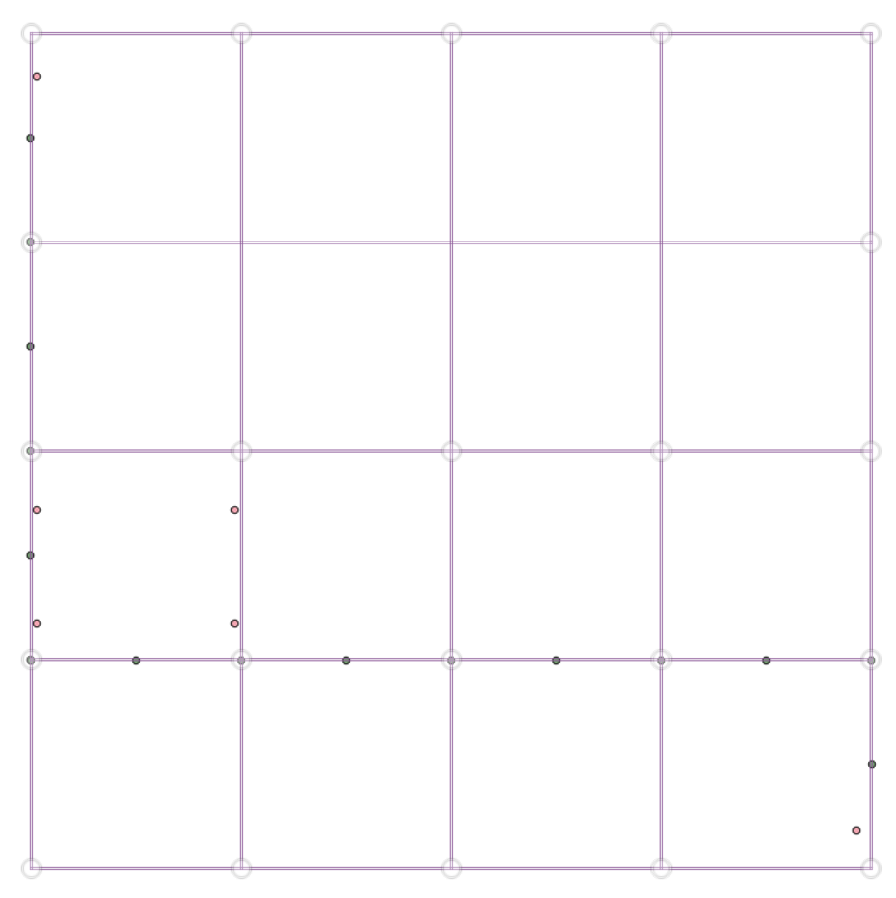
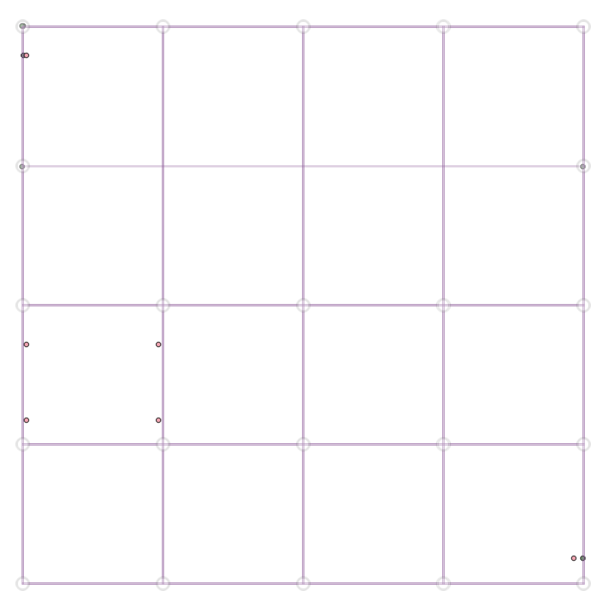

# Beamville
**R5**

**GraphHopper**

* R5 and GH routes are different. Distances: 2255 vs 2880.
* Only `waypoints` layers are visible out of box.
* R5 waypoints reside right in the middle of every lane in the route.
* GH waypoints reside in vertices. Start/end are on lanes, perfectly close to the OD.
* GH route respects the position of origin and contains turnarounds.
* [GitHub Comment](https://github.com/LBNL-UCB-STI/beam/issues/2804#issuecomment-667139581)

## GPX
Open [beamville.qgz](beamville.qgz) in *QGIS*.
