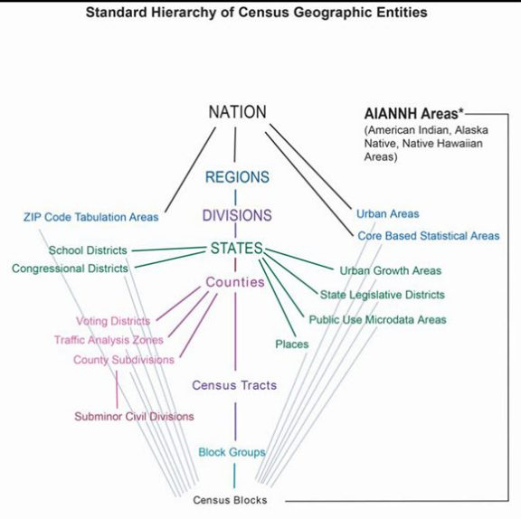

#Beam scenario generator
## Data sources
To generate new scenario for Beam by [beam.utils.data.synthpop.SimpleScenarioGenerator](../ScenarioGenerator.scala) we need to provide the following information:
1. For every county, two files: household_STATE_COUNTY.csv and people_STATE_COUNTY.csv as an output of SynthPop. How to run it: https://github.com/LBNL-UCB-STI/synthpop#how-to-run-it
2. Census Transportation Planning Products Program data ([CTPP](https://ctpp.transportation.org/2012-2016-5-year-ctpp/)) for the state, link to FTP: ftp://data5.ctpp.transportation.org/
3. Shape files for:
    1. Traffic Analysis Zone (TAZ) shape file for specific state from Census Bureau: https://www2.census.gov/geo/tiger/TIGER2010/TAZ/2010/
    2. Block Group file for specific state from Census Bureau: https://www2.census.gov/geo/tiger/TIGER2019/BG/
    3. County shape file from https://www2.census.gov/geo/tiger/TIGER2019/COUNTY/ (in case if you want to crop the OSM map using counties' boundaries)
4. Congestion level data for the area in CSV format, for example, from https://www.tomtom.com/en_gb/traffic-index/austin-traffic/
5. Conditional work duration (can be created using [NHTS data](https://nhts.ornl.gov/))
6. OSM PB map of area
7. US state code

## Scenario generator
[SynthPop](https://github.com/LBNL-UCB-STI/synthpop) generates households on **Block Group geo unit**, CTPP does not provide data on that level, the minimum level is **TAZ geo unit**.

Standard Hierarchy of Census Geographic Entities is from https://www.census.gov/newsroom/blogs/random-samplings/2014/07/understanding-geographic-relationships-counties-places-tracts-and-more.html):
 
. As we can see TAZs and Block Groups are on different scale. If we look to the shape files in [QGIS](https://qgis.org/en/site/), we will see the the cases when Block Group is bigger than TAZ and vise-versa. This issue is addressed in the way that we create a map from Block Group to all TAZs by using intersection of their geometries. 

### Flow chart
